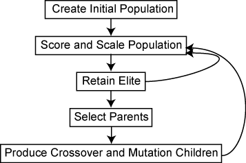
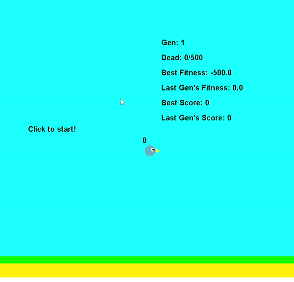
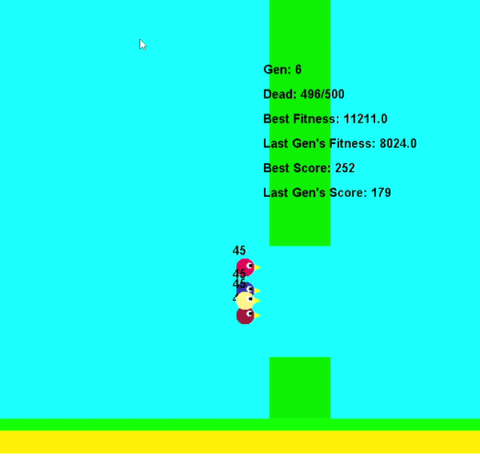

# Smart Flappy Bird with a Genetic Algorithm

## Abstract

This project aims to make an AI that learns how to play Flappy Bird using a genetic algorithm. It involves common machine learning concepts like model design, data preprocessing, and hyperparameter tuning, and genetic algorithm specific techniques like fitness function engineering, elitism, and genetic diversity management. 

## Introduction

Flappy Bird is a game where the player navigates the bird through pairs of pipes with equally sized gaps placed at random heights. The bird automatically descends and only ascends when the player taps the touchscreen. Each successful pass through a pair of pipes awards the player one point. Colliding with a pipe, ground, or the ceiling ends the gameplay.

## Genetic Algorithm

The genetic algorithm is a method for solving optimization problems based on natural selection. 

This flowchart from [MathWorks](https://www.mathworks.com/help/gads/what-is-the-genetic-algorithm.html) summarizes the idea of a genetic algorithm.

1. The initial population is created. Their DNAs are all random.
2. Score population.
3. Choose which entities will pass down their DNAs. Usually, the entities that performed well will be chosen.
4. Produce new batches of DNAs based on the ones from Step 3.
5. Introduce some mutations in DNA for variance. This helps the algorithm to escape the local maxima.
6. Combine the populations from Steps 4 and 5, and go back to Step 2.

### *Genetic Algorithm vs. Reinforcement Learning*

Genetic Algorithm (GA) and Reinforcement Learning (RL) are both optimization algorithms, and the choice between them depends on the nature of the problem, the available computational resources, and the characteristics of the solution space. In RL, the agent improves from interacts with an environment over time. It is well-suited for dynamic and sequential decision-making problems. GA operate on populations of potential solutions, evolving them over generations through processes like selection, crossover, and mutation. It is versatile and effective in global search scenarios due to its solution diversity. Their pros and cons are all similar in context of a simple game like Flappy Bird. I went with GA for its capability to find the global optima.

## Model

The model consists of the following:

1. 3 inputs
   - Horizontal distance traveled, vertical distance to the pipe gap, and vertical distance to the center of the map
   - Inputs are normalized within the (-1, 1) range.
2. 1 hidden layer with 6 fully-connected perceptron
   - Each perceptron takes inputs from the previous layer, multiplies them with its weights, sums up the result, and adds its bias.
3. 1 output
   - The result > 0.5 means perform 'jump'.

This is fairly a small model, but it is suitable for this simple game. Larger model size will increase the complexity, which may encourage more sophisticated behavior, but will slow down the learning process unnecessarily. Instead, more training would yield a better outcome. 

## Result

Before and after:

 

The birds performed very well (200+ scores) after a few generation.

## Discussion

How to escape a local optima:

Genetic diversity is one of the most important aspects of a successful genetic algorithm because a more diverse population has more chance of surviving different environments. There are some features that affect genetic diversity:

1. Population size
2. Crossover method
3. Mutation rate

Without a diverse gene pool, the population may end up in a local optima and cease to improve. To combat this issue, I employed the following techniques:

1. Useful fitness function
   
   I made sure that the fitness function reflects what I want to achieve from this AI. I chose the horizontal distance traveled, the vertical distance to the pipe gap, and the score.  

   $fitness = horizontal_distance + (score * 5) - (gap * 2)$

   This way, the bird is rewarded for traveling further and penalized for staying far away from the next pipe gap (since the bird wants to be close to the gap to increase the chance of passing it).

2. Elitism

   Sometimes a novelty/elite population that outperforms the previous populations shows up during the training. It is worth keeping this elite population and exploiting its useful genes. I ensured that the top three birds of each population get to breed, and those top three birds also get to join the next population's run.

3. Genetic diversity

   To introduce plenty of genetic diversity, I prepared 500 birds for each population (diverse enough for its model size). Also, half of the population is filled with the offspring of the previous elites, and the other half is filled with random birds, so I can ensure a constant supply of new genes

