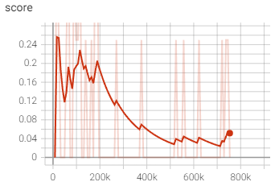
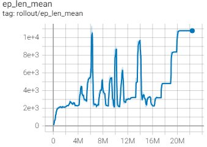
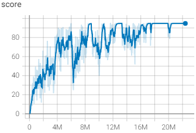
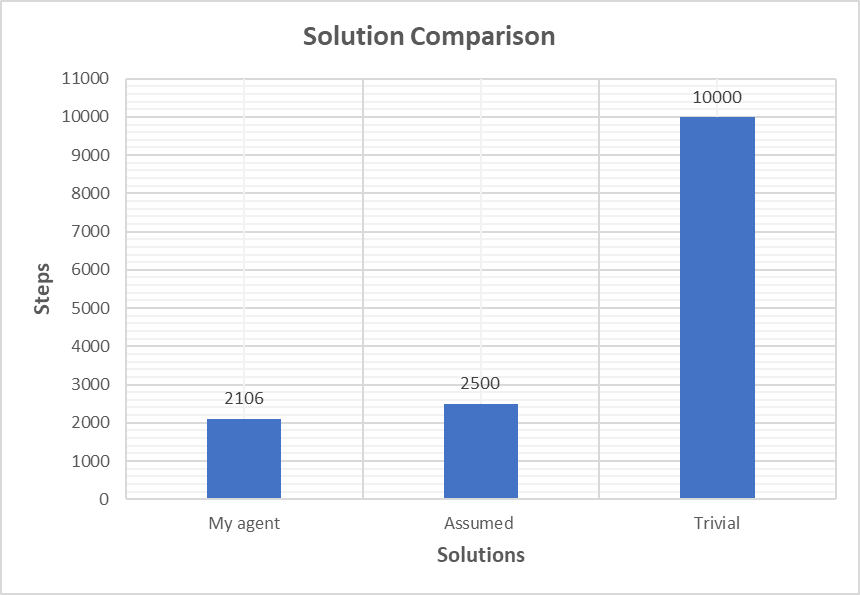

# AI learns to play the Snake game by itself

# <ins>Summary</ins>

Created a self-learning AI for Snake using deep reinforcement learning, particularly Proximal Policy Optimization (PPO). This project served as a valuable learning experience, involving critical research in model selection, reward shaping, hyperparameter tuning, and developing a reusable environment with parallel computing capabilities.

# <ins>Objective</ins>

This project aims to explore deep-reinforcement learning and apply the knowledge to create my own self-learning AI agent. I chose the [Snake](https://en.wikipedia.org/wiki/Snake_(video_game_genre)) game because it is easy to learn, but difficult to master. I was curious if it's true for AIs as well. 

# <ins>Methodology</ins>

## 1. Model Selection

[Image source](https://spinningup.openai.com/en/latest/spinningup/rl_intro2.html)

There are a variety of reinforcement learning (RL) algorithms. Above diagram shows some examples of RL taxonomy. 

### *What is model in RL? Model-based vs. Model-free*

In reinforcement learning, the term "model" typically doesn't refer to a learned neural network but to the design of the environment used for simulation and planning. A model in RL a representation of how the RL agent perceives and interacts with the environment. It includes information about the states, actions, rewards, and transition dynamics.

There are two main types of RL - Model-based and Model-free. Here are some differences:

|       Aspect       |           Model-based            |                   Model-free                   |
|:------------------:|:--------------------------------:|:----------------------------------------------:|
|   Learning type    |       Planning using model       |           Learning from exploration            |
|   Learning speed   |              Faster              |                     Slower                     |
| Sample efficiency  |              Higher              |                     Lower                      |
|     Robustness     | Performs well in accurate models | Performs well in a less-understood environment |

Here is an example from [this blog](https://medium.com/the-official-integrate-ai-blog/understanding-reinforcement-learning-93d4e34e5698):

Let's say an RL AI wants to go visit somewhere, but they don't have a map. A model-based AI will keep track of routes it took before and use them to plan the future trip, whereas a model-free AI will just try anything and find the general direction of the trip.

I decided to go with the model-free algorithms for its robustness. 

### *Model Options*

These are some popular RL algorithm choices when it comes to video games:

1. Deep Q-Network (DQN):
    * DQN is a powerful algorithm, especially when you have a large state space or complex game dynamics. It can handle high-dimensional input data effectively, making it a strong candidate for success in the Snake game.

2. A3C (Asynchronous Advantage Actor-Critic):
    * A3C is particularly useful when you have access to multiple computational resources and can parallelize the training process. This can significantly speed up learning and potentially lead to better results.

3. Proximal Policy Optimization (PPO):
    * PPO is known for its stability and good sample efficiency, making it a strong choice for training agents in various environments. It can also be effective in the Snake game.

I'm running this program in a laptop with a not too powerful CPU (Ryzen 3 3200U). Therefore, I went with PPO for its stability and sample efficiency. I used [Stable Baseline3](https://stable-baselines3.readthedocs.io/en/master/modules/ppo.html)'s PPO implementation because it was easy to use.

## 2. Reward Shaping

The reward system defines the goals for the agent and guides it in learning the desired behavior. Well-designed rewards are critical in finding the desired outcome. There are quite a few things to consider here, which makes reward shaping a challenging task. One of the most common indicator of poor reward system is [premature convergence](https://machinelearningmastery.com/premature-convergence/), which refers to the situation where the agent is stuck at a suboptimal solution. 

### *Reward Density*

|                     |             Sparse Rewards             |    Dense Rewards    |
|:-------------------:|:--------------------------------------:|:-------------------:|
| Feedback Frequency  |                Delayed                 |      Immediate      |
|   Learning Speed    |                 Slower                 |       Faster        |
| Encouraged Behavior |              Exploration               |    Exploitation     |
|       Example       | -1 for game over and +1 for game clear | Rewarded every move |
| Potential Downside  |            Uncertain agent             |    Biased agent     |

The reward density is one of the ways to classify the reward types. It's important to balance the sparse and dense rewards for their unique characteristics. Sparse rewards are intuitive and easy to balance, but it's often not enough feedback for the agent to learn. Here, we can use dense rewards fill that wide state-action space. Paper [[4]](#references) suggests that the agent with human-defined sub-goals had improved learning speed. 

However, we must know that dense rewards are prone to human bias and overfitting [[2]](#references). Paper [[1]](#references) suggests that one should "*specify how to measure outcomes, not how to achieve them*" to produce more robust outcome. For example, let's say I'm training an RL agent to drive a car safely from point A to B, and I gave it a reward for driving straight since it's one of the safe driving method. Unfortunately, this agent might hit a jaywalking person since it's trained to only go straight. In this case, a safe driving measure will be a better feedback than encouraging explicit behavior that the programmer thought was correct. 

### *Reward Function Sanity Check*

|     | Sanity check failures                                           | Brief explanation                                                                                                                                                             | Potential intervention(s)                                                                                                                                                                   |
|-----|:----------------------------------------------------------------|:------------------------------------------------------------------------------------------------------------------------------------------------------------------------------|:--------------------------------------------------------------------------------------------------------------------------------------------------------------------------------------------|
| 1   | Unsafe reward shaping                                           | If reward includes guidance on behavior that deviates from only measuring desired outcomes, reward shaping exists.                                                            | Separately define the true reward function and any shaping reward. Report both true return and shaped return. Change it to an applicable safe reward shaping method. Remove reward shaping. | 
| 2   | Mismatch in people’s and reward function’s preference orderings | If there is human consensus that one trajectory is better than another, the reward function should agree.                                                                     | Change the reward function to align its preferences with human consensus.                                                                                                                   |
| 3   | Undesired risk tolerance via indifference points                | Assess a reward function's risk tolerance via indifference points and compare to a human-derived acceptable risk tolerance.                                                   | Change reward function to align its risk tolerance with human-derived level.                                                                                                                |
| 4   | Learnable loophole(s)                                           | If learned policies show a pattern of undesirable behavior, consider whether it is explicitly encouraged by reward.                                                           | Remove encouragement of the loophole(s) from the reward function.                                                                                                                           |
| 5   | Missing attribute(s)                                            | If desired outcomes are not part of reward function, it is indifferent to them.                                                                                               | Add missing attribute(s).                                                                                                                                                                   |
| 6   | Redundant attribute(s)                                          | Two or more reward function attributes include measurements of the same outcome.                                                                                              | Eliminate redundancy.                                                                                                                                                                       |
| 7   | Trial-and-error reward design                                   | Tuning the reward function to improve RL agents' performances has unexamined consequences.                                                                                    | Only use observations of behavior to improve the reward function's measurement of task outcomes or to tune separately defined shaping reward.                                               |
| 8   | Incomplete description of problem specification                 | Missing descriptions of reward function, termination conditions, discount factor, or time step duration may indicate insufficient consideration of the problem specification. | In research publications, write the full problem specification and why it was chosen. The process might reveal issues.                                                                      |

Above table is the reward function sanity check table from paper [[1]](#references). It says, "Each sanity check is described by what problematic characteristic to look for. Failure of the first 5 sanity checks identifies problems with the reward function; failure of the last 3 checks should be considered a warning." It was easy for me to go down the rabbit hole of keep adding more heuristics to the agent in attempt to improve it, so I referenced this sanity check to keep my reward function in check. 

### *Exploration and Exploitation*

We want our agent to make the most informed decisions, and that information can be gained from exploration. To encourage exploration, we have to make it rewarding. One way to achieve that is implementing intrinsic rewards, also known as curiosity rewards, such as rewards for new discoveries and improved knowledge. See [OpenAI page](https://openai.com/research/reinforcement-learning-with-prediction-based-rewards) and [blog page](https://lilianweng.github.io/posts/2020-06-07-exploration-drl/) for much more in-depth explanation of exploration in RL. I implemented curiosity reward by adding a memory to the agent - rewarding the agent for finding different states of the game. 

Exploitation is not always a bad thing. It means the agent found a good plan to maximize the reward. However, it becomes a problem when the reward structure is mis-designed. One of the example of this is 'the noisy-tv problem.' It happens when the agent finds a source of randomness in the environment and continuously harvest intrinsic rewards, without getting closer to the ultimate goal. This problem is mentioned in the 4th point of the sanity check table. In my curiosity reward system, the snake may end up circling at a corner for this reason. So, I adjusted the state difference threshold to balance what is considered a new game state.

[The noisy-tv problem](https://openai.com/research/reinforcement-learning-with-prediction-based-rewards)

### *Dynamic Rewards*

|                         Dynamic Reward Test                          |                                                                      | 
|:--------------------------------------------------------------------:|:--------------------------------------------------------------------:|
|  |  |
|               Red: dynamic reward / Blue: fixed reward               |       Left: Game length / Middle: Total reward /  Right: Score       |

Like many other video games, Snake game progressively gets more challenging as you play, so adjusting the feedback becomes crucial in reflecting the real game play experience. I noticed that the priority for making safe move gets increasingly important as the snake gets longer. Based on that, I implemented a dynamic reward and penalty system.

It starts with a small safe-move reward in the early game to encourage/greedy behavior while the risk of collision is lower. As the game progresses, the gradual increment of safe-move reward should teach the agent that it's better to be safe than sorry. Also, this increment of overall reward should positively affect the learning behavior as demonstrated in paper [[3]](#references). It says, "when defining subgoal rewards, it helps to gradually increase rewards as the agent gets closer to the goal state. This design helps counteract the effect of discounting, but also continually spurs the agent forward, much like an annual salary raise is considered to be a good motivator in the commercial sector."

Above charts show this system in action. Although agent with fixed reward got more reward, but the agent with dynamix reward survived longer and scored higher.

### *Human Bias in Rewards*

|                Inefficient Move Penalty Test                 |
|:------------------------------------------------------------:|
|  |
|          Green: without penalty / Red: with penalty          |
|           Left: Game length / Right: Total reward            |

Giving meaningful feedback can be hard because it often requires a deep understanding of the environment, which is not always possible. I learned that reward shaping is particularly prone to human bias and difficult to balance. For instance, I tested how penalizing the agent for making bad moves (getting trapped, repeating meaningless moves, etc.) affects the agent. Intuitively, penalizing the agent for making bad moves should encourage it to make good move, right? Interestingly, as shown the charts above, agents performed better without penalties in many cases. So, the penalties made the agent dumber. This result is also in line with the finding from [[3]](#references), "penalizing each step taken induces faster learning than rewarding the goal" - excess penalties encourage a hasty learning behavior.

After all, reinforcement learning is an optimization algorithm, not a behaviour-copying algorithm. Therefore, The RL agent will do the best in the given environment, but if the environment does not reflect the goal properly, then the agent is bound to fail. That's why I also focused on providing more and better quality information to the agent, so it can make more intelligent decision. 

### *Implemented Rewards*

When implementing the rewards, it's important to build it around the ultimate goal. Otherwise, it's easy to get sidetracked. The ultimate goal of the snake game is to complete the game by getting the maximum score. Although the player must eat apples to complete the game, it will be all meaningless if they die while doing so. With that in mind, I analyzed some snake game strategies and sorted them in the list below based on their priority. 

Action Priorities:
1. Survival
   1. Do not collide with wall or self
   2. Avoid looping infinitely
2. Safe moves
   1. Keep the tail reach-able
   2. Do not make a void (open area where the head can't enter)
   3. Do not make a void seed (1 cell surrounded on 3 sides)
3. Eating apple
4. Hugging collide-able cells (lesser chance of creating voids)
5. Exploration

Using that action priorities, I've balanced feedback density with sparse rewards based on the game's outcome and dense rewards for general guidance, like exploration and move feedback. While I considered additional rewards (ex: survival, proximity to the apple, distance from the tail), I limited further feedback to avoid premature convergence. For instance, frequent survival rewards can discourage exploration despite encouraging safe movements.

Sparse rewards:
* Game completion (+)
* Game over (-)

Dense rewards:
* Eating apple
* Making safe moves
* Exploration

## 3. Agent's Observations (Input)

For the agent to make connections between rewards and actions, it needs access to essential game state information (called 'observation' in Stable Baseline3). More information can yield more sophisticated behavior, but it can also cause longer training time. 

### *Quality over Quantity*

 

I experimented how quality and quantity of information affect the agent's behavior. For example, above is the result from playing around with the number of past moves from the current round an agent can reference. The left graphs is the average steps per game, and the right graph is the average reward per game. I tested 5, 20, 70 and 200 recent moves, and ran each of them for about 1.5M steps. I let 200-moves one learn longer to compensate the decreased rate from more complex information. Surprisingly, the number of recent moves did not change the agent's learning behavior and performance too much. They all have similar trends overall.

Possible explanations for this behavior are:

1. The 'past moves' information was not important in learning due to its poor information quality.
2. The reward structure did not represent the goal of the game.

Since I confirmed that I can't just chuck everything at the agent and expect it to do better, I needed to feed it quality information. 

|  |    |
|:-----------------------------------------------------:|:-----------------------------------------------------:|
|                      Square View                      |                       Line View                       |

I experimented with providing view information to the agent. I tried two types: square view and line view around the snake's head. In the images above, green tiles are the snake, black tiles are the wall, red tile is the apple, and the gray tiles are the tile that the agent can see. The agent is given the type of the tile (wall, empty, snake, and apple) and distance to that tile. Also, like straight, left, and right actions, the view is also rotated based on the direction of the head, so it's more consistent (ex. the view is rotated clockwise if the snake is looking left). Unfortunately, adding this kind of view information wasn't effective as the agent failed to improve beyond score 10 because it couldn't figure out which move can lead to a dead end using its short range of sight. It might need more sophisticated processing like CNN to truly take advantage of view information. However, I was able to use this view information to implement curiosity reward. I took the view information and compared it with others in the past. If it's different enough, then the agent gets an exploration reward. This will encourage the agent to explore the grid.

|  |
|:----------------------------------------------------:|
|                Score using CNN Policy                |

So I tried SB3's CNN policy. I switched the agent's observation to the game board image. Since CNN extracts a lot of information from the image, I removed some dense rewards hoping that the agent will figure out the game rule using the rich visual data without needing frequent feedback. Unfortunately, the agent couldn't even reach score 1 as shown in the graph above. Also, the training speed was about 3-4 times slower than MlpPolicy where I fed some heuristics manually. I could probably improve the agent's performance by stacking the frames, so it can tell the movements in the image. But right now, CNN method was too heavy to run in my device.

|      |
|:-----------------------------------------------------------------:|
|                          Score over time                          |
| Orange: can only see current board, Gray: can see on 1 step ahead |

Then, instead of waiting for the agent to figure out rule from scratch visually, I gave it a nudge by allowing the agent to look 1 step into the future. I told it which actions will lead to collision, lead to the largest open area, create voids, eliminate gaps that can become a void, cut access to the tail, etc. As shown in the graph above, this implementation increased the score from 10 to 120 for 20x20 grid game.

### *Improving Data Quality with Data Preprocessing*

Like any machine learning process, reinforcement learning benefits from data preprocessing. In my case, data normalization and one-hot encoding was particularly useful.
* Normalization is a fundamental preprocessing step in machine learning that contributes to the stability, efficiency, and generalization capabilities of models, making them more robust and suitable for a wide range of applications.
* One-hot encoding is a technique used in data preprocessing to represent categorical variables as binary vectors. It can prevent model bias from ordinal assumptions (ex. thinking that 'red' is greater than 'blue' because it comes first) and improve performance.

With those in mind, this is a list of information I fed to the agent:

1. Normalized snake head position
2. Normalized Apple position
3. One-hot encoded snake head direction
4. One-hot encoded direction to apple 
5. Normalized current score
6. Evaluation of 1-step future actions
   * A boolean 'collision'.
   * A boolean 'visited'. Re-visiting a cell is can be an inefficient move.
   * A boolean 'void created'. Creating unreachable voids is a fatal move because it restricts snake's movement.
   * A boolean 'can reach tail'. Being able to reach the tail means the escape route is available. 
   * A boolean 'hugging'. Being adjacent to wall or body means there's less chance of creating a void. 
7. Evaluation of current body positions
   * A boolean 'trapped' info to check if the snake head is trapped in a void. 
8. Evaluation of apple safety (whether it's stuck in a dead-end)

I could add more complex heuristics to produce better outcome, however, it is like an endless wack-a-mole game at that point. Instead, I should find more elegant information delivery method. I think I can get inspiration from analyzing how human solve the problem. For now, this will do the job. 

## 4. Hyperparameter Tuning

| Hyperparameter                           | Description                                                     | Effect of Change                                                                        | Common Range/Value                                        |
|------------------------------------------|-----------------------------------------------------------------|-----------------------------------------------------------------------------------------|-----------------------------------------------------------|
| **Learning Rate (lr)**                   | Step size for policy optimization.                              | Influences the speed of learning.                                                       | 1e-5 to 1e-3. I went with 3e-4.                           |
| **Clip Parameter (clip_epsilon)**        | Maximum allowed policy change ratio.                            | Stabilizes training by limiting policy updates.                                         | 0.2                                                       |
| **Number of Epochs (n_epochs)**          | Number of times data is reused for updates.                     | More epochs can lead to more stable policy updates.                                     | 1 to 10                                                   |
| **Batch Size (batch_size)**              | Number of samples in each policy update.                        | Larger batch sizes may yield more accurate gradient estimates.                          | Varies. I went with 1024.                                 |
| **Value Function Coefficient (vf_coef)** | Weight of the value function loss.                              | Controls the balance between policy and value updates.                                  | 0.5                                                       |
| **Entropy Coefficient (ent_coef)**       | Weight of the entropy term.                                     | Influences the level of exploration in the policy.                                      | 0.01. I went with 0.001.                                  |
| **Discount Factor (gamma)**              | Trade-off between immediate and future rewards.                 | Higher value favors long-term rewards.                                                  | 0.99                                                      |
| **GAE Lambda (gae_lambda)**              | Controls weight of accumulated rewards in advantage estimation. | Adjusts the impact of the GAE calculation on the advantage.                             | 0.95                                                      |
| **Number of Parallel Environments**      | Number of parallel workers (if used).                           | Impacts training speed and stability.                                                   | More the better. I went with 4 due to the hardware limit. |
| **Network Architecture**                 | Design of policy and value function networks.                   | Influences the complexity of the model and its ability to capture patterns in the data. | Varies. I went with MlpPolicy.                            |
| **Optimization Algorithm**               | Choice of optimization algorithm (ex., Adam, RMSprop).          | Affects convergence speed and stability.                                                | Varies. Adam in Stable Baseline3's PPO.                   |

PPO has quite a few hyperparameters, and each of them affect the agent's behavior differently. Check [Stable Baseline3](https://stable-baselines3.readthedocs.io/en/master/modules/ppo.html)'s implementation, too. Above table explains some important hyperparameters. I played with hyperparameters and here are some experiment results:

### *Learning Rate*

I played around with learning rate to observe its effect on agent's behavior. Green is lr=0.00003 and Red is lr=0.003. As expected, higher learning rate yielded a faster result. If Green was given enough time, it might have yielded a better result than Red. However, since time and performance is a trade-off, Green can be less practical. 

### *Entropy Coefficient*

I played around with entropy coefficient to observe its effect on agent's behavior. Orange is ent_coeff=0.001 and Gray is ent_coeff=0.1. I thought higher entropy coefficient would encourage exploration, but it was quite the opposite for this test. Maybe 0.1 was too much randomness that the Gray agent's decisions were contaminated by noises.

## 5. Custom Environment

Stable Baseline3 supports custom environment, so I was able to create my own Snake game. This eliminated dependencies like the need for the game ROM, and allowed full customization ability. Also, I took advantage of environment vectorization and wrapping. Using SubVecProcEnv, I parallelized the computing and improved the training speed by 3 times. I used VecMonitor wrapper to document the training record on a TensorBoard, which made reading and comparing records easier. I also used a custom callback to save certain information and models. 

# <ins>Discussion</ins>

## 1. Result

|  |  |
|:-------------------------------------------------------------:|:------------------------------------------------------------:|
|                          Game length                          |                          Score                               |

I trained the agent for 22M steps in a 10x10 grid game. I noticed that the max score is reached around steps 9M, 13M, and 17M steps. Although the 17M one is trained for the longest, the 13M one has the lowest average game length, so I chose 13M one for the final test. I ran 100 games, and the result is the following:

| Game Result | Occurrences | Ave. Score | Ave. Steps |
|:-----------:|:-----------:|:----------:|:----------:|
|  Completed  |     70      |     97     |    2106    |
|    Dead     |     17      |     78     |    1902    |
|  Got stuck  |     13      |     90     |    4000    |

The result shows that the win rate is 70%, which is pretty decent considering the complexity of the snake game. In the rest of 30%, snake either got stuck in an infinite loop or died. The infinite loop is likely caused by poor reward shaping, and the death is likely caused by the lack of information from the incorrect environment design. 

The above gif is the footage of a full, completed run for demonstration. 

## 2. Evaluation Criteria

There is an infallible non-RL solution for the Snake game. The snake can simply follow a Hamiltonian Cycle, a cyclic path that passes every square on the grid without crossing itself. This is a trivial solution, but it can be a good reference to measure my snake agent's performance. If the snake travel the entire grid for each apple, then the total steps for a completed game can be the grid-area squared (10000 steps for 10x10 grid). I can make some assumptions to make this number more realistic. I'll assume that the average steps required to eat apple at any point is half of the number of remaining unoccupied cells.

Let's define some variables first:
* N = the grid size
* L = the snake's length
* m = the snake's starting length, where 0 < m < N2 

Then, the average total steps per game would be:
> $$\displaystyle \lim_{L \to \infty} \int_{m}^{N^2} \frac{N^2-L}{2} dL$$

Solving it gives:
> $$\frac{N^4}{4}$$

The expected average game length to finish the 10x10 game is 2500 steps.

## 3. Evaluation

The average steps of the winning games are 2106, which is 18.7% faster than the assumed solution and 374.8% faster than the trivial solution. I'm quite surprised that my agent performed better than the assumed average run. Unfortunately, my reward shape might've been an over-fit to the 10x10 game, as it only got 120/400 point in a 20x20 game. I'll likely need to re-evaluate the dense rewards, and provide more meaningful information to the agent. 

# <ins>Conclusion</ins>

In this project, I developed a self-learning AI for the Snake game using the Proximal Policy Optimization (PPO) reinforcement learning algorithm. From this project, I acquired a solid understanding of the fundamentals of reinforcement learning, laying a robust groundwork for future projects in this domain. It encompassed aspects such as model selection, reward shaping, hyperparameter tuning, custom environment creation, and comprehensive documentation.

In particular, reward shaping emerged as a complex and captivating challenge. Initially viewing reinforcement learning as a straightforward 'carrot and stick' problem, I soon delved into its intricacies, considering nuanced aspects such as the purpose, frequency, and magnitude of rewards. I had to wrestle with biases and ambiguities in reward shaping. For instance, my intuitive design fell short in several instance due to its inherent design flaws. Overcoming these hurdles involved thorough research and implementation of strategies such as reward function sanity checks and dynamic reward shaping. I also found the intrinsic reward (curiosity reward) fascinating, since it made the RL agent a lot more human-like, introducing another layer of depth in the model. 

While my agent demonstrated overfitting to a 10x10 game, I've gained insights into the underlying reasons and identified avenues for improvement. Several areas for future enhancement include:

* Exploring more nuanced and accurate methods for evaluating outcomes, moving beyond simplistic metrics like score. So Far what I have are factors such as the number of voids and tail reachability.
* I can improve upon the CNN policy by experimenting with advanced techniques like frame stacking to capture the sense of movement in images. Additionally, I can explore synergies by combining heuristic approaches with CNN to enhance learning outcomes.
* Implementing a more sophisticated memory system, such as Long Short-Term Memory (LSTM), to enable the agent to learn fine techniques from individual games and overarching strategies from multiple runs. 
* Introducing an auto-hyperparameter tuning feature, streamlining the process of finding optimal configurations for faster and more efficient model training.

# <ins>References</ins>

1. Knox, W. B., Allievi, A., Banzhaf, H., Schmitt, F., & Stone, P. (2023). Reward (Mis)design for autonomous driving. Artificial Intelligence, 316, 103829. https://doi.org/10.1016/j.artint.2022.103829
2. Booth, S., Knox, W. B., Shah, J., Niekum, S., Stone, P., & Allievi, A. (2023). The Perils of Trial-and-Error Reward Design: Misdesign through Overfitting and Invalid Task Specifications. Proceedings of the AAAI Conference on Artificial Intelligence, 37(5), 5920-5929. https://doi.org/10.1609/aaai.v37i5.25733
3. Sowerby, H., Zhou, Z., & Littman, M. L. (2022). Designing rewards for fast learning. 
https://doi.org/10.48550/arXiv.2205.15400
4. T. Okudo and S. Yamada, "Subgoal-Based Reward Shaping to Improve Efficiency in Reinforcement Learning," in IEEE Access, vol. 9, pp. 97557-97568, 2021, doi: 10.1109/ACCESS.2021.3090364. 