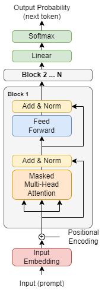
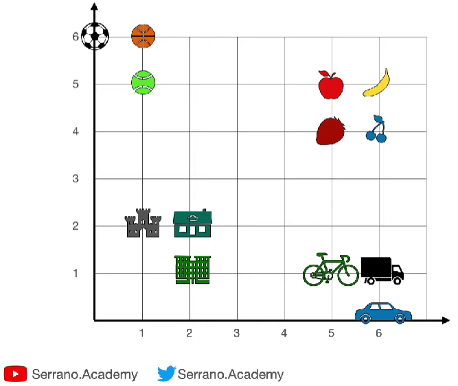
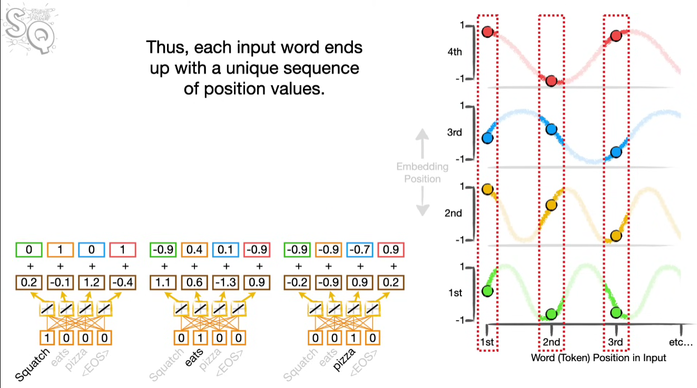
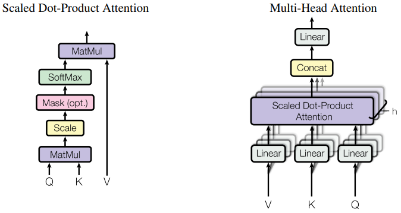
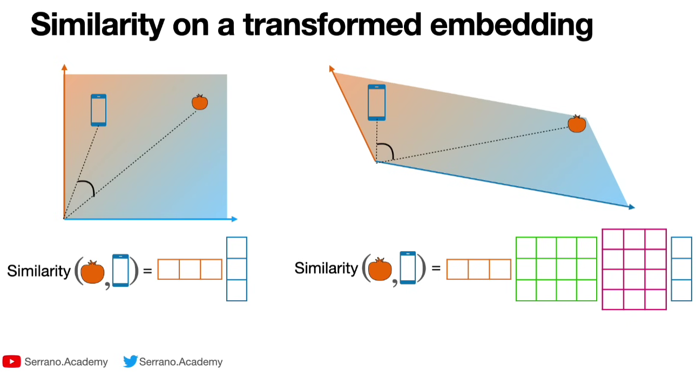
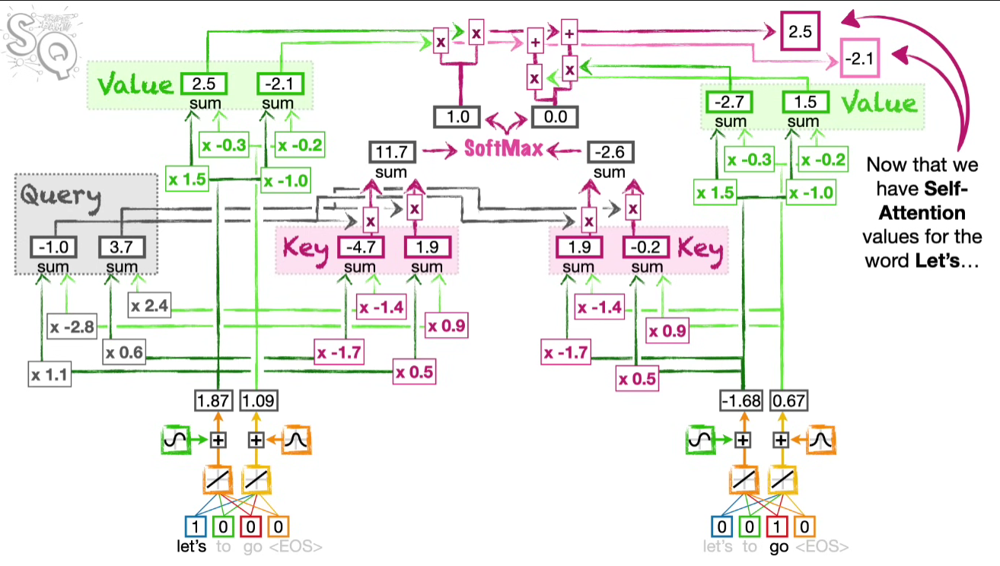

# Building a Generatively Pretrained Transformer (GPT) from Scratch.

## <ins>Introduction</ins>

Transformers are at the core of many state-of-the-art generative models like ChatGPT. I built a Generatively Pretrained Transformer (GPT) from scratch using PyTorch and learned the transformer architecture essentials. 

From this exercise, I learned:
1. Decoder-only Transformer architecture.
2. Text encoding techniques.
3. Text embeddings
4. Positional encodings
4. Attention mechanism (self and multi-headed)
5. Key points of transformers like residual path and layer normalization 
6. How to make training data for decoder-only models.
6. How to put everything together in PyTorch to make a character-level text predictor


This notebook follows [Andrej Karpathy's tutorial](https://youtu.be/kCc8FmEb1nY?si=sX6u7bh1uh_UUeFv).

## <ins>Decoder-Only Transformer Architecture</ins>

[//]: # (![img.png]&#40;readme_images/transformer_architecture.png&#41;)
[//]: # ()
[//]: # (Above is a good infographic of a full transformer from [this article]&#40;https://medium.com/@amirhossein.abaskohi/navigating-transformers-a-comprehensive-exploration-of-encoder-only-and-decoder-only-models-right-a0b46bdf6abe&#41;. A full transformer has an encoder-decoder architecture.)



[[Image source]](https://ai.stackexchange.com/a/40180)

A decoder-only transformer takes in one sequence and uses it as both input and target, whereas an encoder-decoder transformer takes in separate input and target. I want to make a simple text generation model that produces Shakespeare's writing style, which is what a decoder-only transformer excels at. This decoder-only transformer predicts the next character based on given characters. Because this model will not be fine-tuned for specific purposes, there is no encoder or cross-attention - only decoder and self-attention. So, there are no constraints at the moment to control the model's behavior. It will just produce whatever text makes sense until it decides not to or the text output limit is hit.

There are many online resources about transformers. For me, watching [this video from Serrano Academy](https://www.youtube.com/watch?v=qaWMOYf4ri8&ab_channel=Serrano.Academy) and [this video from StatQuest](https://youtu.be/zxQyTK8quyY?si=sl4lknKj5G5vNnzQ) helped me get started.

### *Text Tokenization/Encoding*

Text tokenization is the step of breaking down the text into tokens for the model to digest. In general, sophisticated tokenization methods can yield more complex outcomes - it can be as easy as character-based and as complex as byte-pair encoding or more. Here are some aspects to consider for tokenization methods:

| Token unit                               |                   Larger (ex. word)                    |                       Smaller (ex. character)                       |
|------------------------------------------|:------------------------------------------------------:|:-------------------------------------------------------------------:|
| Vocabulary size                          |                         Larger                         |                               Smaller                               |
| Chance of getting out-of-vocabulary case |                         Higher                         |                                Lower                                |
| Preservation of semantics                |                         Higher                         |                                Lower                                |
| Use cases                                | Where the meaning is important like sentiment analysis | Where the granule information is important like spelling correction |

For ease of implementation, I used character-based tokenization - giving each character an integer value.  The text data I used is a Shakespeare text - around 1M characters with 65 unique characters ( !$&',-.3:;?ABCDEFGHIJKLMNOPQRSTUVWXYZabcdefghijklmnopqrstuvwxyz). It's in a play format like this:

```
First Citizen:
Before we proceed any further, hear me speak.

All:
Speak, speak.

First Citizen:
You are all resolved rather to die than to famish?
```

### *Training Data*

I'll need training data to help my model predict the next character based on previous characters. The training data is created by taking a piece of text for context and separating it into inputs and targets:

```
Context: [18, 47, 56, 57, 58,  1, 15, 47, 58]

input [18]                              target: 47
input [18, 47]                          target: 56
input [18, 47, 56]                      target: 57
input [18, 47, 56, 57]                  target: 58
input [18, 47, 56, 57, 58]              target: 1
input [18, 47, 56, 57, 58,  1]          target: 15
input [18, 47, 56, 57, 58,  1, 15]      target: 47
input [18, 47, 56, 57, 58,  1, 15, 47]  target: 58
```

This set is a training batch where the context word forms a triangle at the bottom left. This is brought up again in the attention section. 

### *Input Embeddings*

Embedding is the bridge between natural language and computer. We associate information with words. Then, similar words will be closely associated. This method of embedding is called Word2Vec. 
[This video from Serrano Academy](https://youtu.be/OxCpWwDCDFQ?si=Ls7fFk-5NjQSfqWi) helped me understand word embeddings. In PyTorch, I can simply use `nn.Embedding`.



The above graph is a simple visual representation of embeddings, where similar words are closer to each other than non-similar words. 

### *Positional Encoding*

The token's position is encoded in an embedding, usually by manipulating the token strategically, so we can distinguish phrases with the same tokens but in different order. There are many positional encoding methods, and one of the popular methods is to use alternating sine and cosine with different frequencies (a.k.a pre-computed positional encoding):



The above image from [StatQuest's video](https://youtu.be/zxQyTK8quyY?si=2Xfai9PE6kRFkxES&t=450) visualizes this method well. Since sines and cosines have different frequencies, we can ensure the uniqueness of their values at different spots. 

In this exercise, I went with the trainable positional encoding with `nn.Embedding` layer because the performance and model size difference are minimal, and this is much easier for me to implement. 

### *Attention Mechanism*

Context is important in interpreting a word, especially when it is ambiguous, such as 'it' and 'that.' In the transformer, context is captured using the attention mechanism. Simply put, attention makes the similar words get closer in the embeddings. 

Although we already have word embeddings and positional encodings, the transformer takes an extra step and uses more embeddings called Keys, Queries, and Values vector (implemented using `nn.Linear` in my case), forming an `Attention Head`. 

We can have multiple unique attention heads (sets of Keys, Queries, and Values) to create a `Multi-Head Attention`, where each head deals with an equal portion of embedding, and the result is concatenated to form a full n_embed size embedding, effectively adding more depth to the model without adding more embedding that is more expensive to add.



The attention diagram from the original paper, [Attention is all you need](https://arxiv.org/abs/1706.03762).

Attention mechanism:

1. A Query is used to 'ask' other words in the sequence for word similarity comparison. 
2. A Key is provided by each word in 'response' to the query.
3. The Query and Key similarity is calculated. Many methods are possible, and the goal is to assign more weight to similar words. 
   1. Dot product (distance between words)
   2. Cosine similarity (angle difference between words from origin)
   3. Scaled dot product (dot product / sqrt of vector length). In my implementation, I used the scaled dot product to make the gradient a unit gradient so the softmax will not be saturated and become a hot-hot vector, losing the context information from similarity calculation. 
4. Softmax the result from step 3 to convert the result into probability form. Softmax is used instead of simple average because of negative numbers.
5. Add the result from step 4 to the Value to obtain the final similarity score. 



[Math behind attention by Serrano Academy](https://youtu.be/UPtG_38Oq8o?si=HOEvo16YS0ZJxMXn) shows an intuitive and visual explanation of K, Q, and V vectors, 



And [this video from StatQuest](https://youtu.be/zxQyTK8quyY?si=w45J2WISZ7z0xhBc&t=773) shows more detailed roles of K, Q, and V vectors in a transformer. 

I implemented a decoder-only architecture, and the decoder uses a self-attention mechanism that uses its own Keys and Queries to compute attention. If we use Keys and Queries from other places, like an encoder, then it's called a cross-attention. 

#### Decoder can't look at future words:

The decoder block's attention block has the keyword `Masked`. Since the decoder has to complete the text by predicting the next word based on given words, it should not know what comes in the future, so we mask the reference to the future text.

```
tensor([[-1.7629, -1.3011,  0.5652,  2.1616, -1.0674,  1.9632,  1.0765, -0.4530],
        [-3.3334, -1.6556,  0.1040,  3.3782, -2.1825,  1.0415, -0.0557,  0.2927],
        [-1.0226, -1.2606,  0.0762, -0.3813, -0.9843, -1.4303,  0.0749, -0.9547],
        [ 0.7836, -0.8014, -0.3368, -0.8496, -0.5602, -1.1701, -1.2927, -1.0260],
        [-1.2566,  0.0187, -0.7880, -1.3204,  2.0363,  0.8638,  0.3719,  0.9258],
        [-0.3126,  2.4152, -0.1106, -0.9931,  3.3449, -2.5229,  1.4187,  1.2196],
        [ 1.0876,  1.9652, -0.2621, -0.3158,  0.6091,  1.2616, -0.5484,  0.8048],
        [-1.8044, -0.4126, -0.8306,  0.5899, -0.7987, -0.5856,  0.6433,  0.6303]],
       grad_fn=<SelectBackward0>)
```

Attention vector before masking. Considering the training data where the context words are located in the bottom-left triangle, the top-right triangle part should not be considered since there is no data there. 

```
tensor([[-1.7629,    -inf,    -inf,    -inf,    -inf,    -inf,    -inf,    -inf],
        [-3.3334, -1.6556,    -inf,    -inf,    -inf,    -inf,    -inf,    -inf],
        [-1.0226, -1.2606,  0.0762,    -inf,    -inf,    -inf,    -inf,    -inf],
        [ 0.7836, -0.8014, -0.3368, -0.8496,    -inf,    -inf,    -inf,    -inf],
        [-1.2566,  0.0187, -0.7880, -1.3204,  2.0363,    -inf,    -inf,    -inf],
        [-0.3126,  2.4152, -0.1106, -0.9931,  3.3449, -2.5229,    -inf,    -inf],
        [ 1.0876,  1.9652, -0.2621, -0.3158,  0.6091,  1.2616, -0.5484,    -inf],
        [-1.8044, -0.4126, -0.8306,  0.5899, -0.7987, -0.5856,  0.6433,  0.6303]],
       grad_fn=<SelectBackward0>)
```

Attention vector after masking. The non-context parts are masked away. 

```
tensor([[1.0000, 0.0000, 0.0000, 0.0000, 0.0000, 0.0000, 0.0000, 0.0000],
        [0.1574, 0.8426, 0.0000, 0.0000, 0.0000, 0.0000, 0.0000, 0.0000],
        [0.2088, 0.1646, 0.6266, 0.0000, 0.0000, 0.0000, 0.0000, 0.0000],
        [0.5792, 0.1187, 0.1889, 0.1131, 0.0000, 0.0000, 0.0000, 0.0000],
        [0.0294, 0.1052, 0.0469, 0.0276, 0.7909, 0.0000, 0.0000, 0.0000],
        [0.0176, 0.2689, 0.0215, 0.0089, 0.6812, 0.0019, 0.0000, 0.0000],
        [0.1691, 0.4066, 0.0438, 0.0416, 0.1048, 0.2012, 0.0329, 0.0000],
        [0.0210, 0.0843, 0.0555, 0.2297, 0.0573, 0.0709, 0.2423, 0.2391]],
       grad_fn=<SelectBackward0>)
```

Attention vector after softmax. Now, the attention weight is forming a probability distribution, which is a convenient form to use. 

### *Feed Forward*

The feed-forward is a simple densely-connected layer where the learning happens. It's made of two `nn.Linear`, `ReLU`, and `Dropout` layers. The linear layers size up (x4 in the original paper) the number of features and bring it down again, adding more depth to the information. 

### *Other important features*

#### Residual connection 

Deep neural nets suffer from optimization issues due to diminishing gradient. We can mitigate this issue with [residual connection](https://arxiv.org/abs/1512.03385) (Skip-connection), where we reserve the gradient by ensuring an unobstructed 'gradient highway'. Whenever data needs to be processed and transformed, we make a branch from the original path, apply the transformation, and add it back to the original path. Here, addition is used because addition distributes the gradient equally in both residual and branched-off paths.   

#### Layer Normalization

As the name suggests, in Layer normalization, the elements are normalized across each layer to stabilize the learning. Unlike the original paper's implementation, I applied normalization before the attention head instead of after because it's the trend now. See [this video](https://youtu.be/G45TuC6zRf4?si=EzrPZbn4d5i_BBA2) for more information on layer normalization. 

#### Blocks

Like we used multiple attention heads to increase the model complexity, we can also use multiple blocks for the same reason. As shown in the model architecture diagram, in the beginning, a block is a sequence of attention, layer norm, feedforward, and layer norm again. 

#### Token Selection Strategies

The raw output of the transformer is a discrete probability distribution over all possible tokens calculated using the softmax function. There are a few strategies we can use to produce more varied output. 

* Temperature amplifies the softmax function, so a higher temperature will make the output more random.
* Top-K limits the output to a certain number (K) of the top tokens.
* Top-p limits the output to the top tokens within a certain probability mass (p).

Check [this article](https://peterchng.com/blog/2023/05/02/token-selection-strategies-top-k-top-p-and-temperature/) for more information on temperature, k, and p.

#### Fine-tuning

Transformer is made to guess the next word. It will produce a very general answer from its learned data, such as random things from the internet like articles, stories, questions, etc. We need to fine-tune it based on the need, such as QnA, command/action, and chatting, by feeding those data formats. (https://openai.com/blog/chatgpt). But as I mentioned, this exercise is not focused on fine-tuning.

## <ins>Result and Discussion</ins>

Here is the result with the following conditions:

1. Context size = 256 (the context length for predictions)
2. Learning Rate = 3e-4
3. n_embd = 384 (number of features per token)
4. n_head = 6 (number of heads in the multi-head attention)
5. n_layer = 6 (number of attention blocks) 
6. dropout = 0.4
7. Training iterations = 5000 steps (~50 minutes on a T4 GPU)

```
CAMILLO:
Whither, this schots that swear to me
Have me serven; blook'd uplacks orne
And to kitle gates plument.
For a kneeling manhelly I duty,
It honouself is upon my my sweet father;
As I want fraill it is: our in vanife
Esideness
Which mean in mistolt pillarching this.

CAMILLO:
I do remenge from my persuitf.

AELLASA:
Peace, but boy?
I hope it o't: 'tis the Ire two
Is aguit one the dangerous flesh;
That I am not, if you appear 'emades,
You rathle.

LEONTES:
What's my honest sing's but I'll far at nor
To pray you, but yours; even young Parisne
Against your ladysiders. who's face?
How does be the bod of your
That yet? so sland by, our will cook
Foundamed: who becanst our gate, sucked place
Whose pleasing blush voicy I do,and cannot receive
The Camillo when you that sensiors or
Call it the more than him is and anoyal.
```

As we can see, the model learned how to produce Shakespeare-like text pretty well. I can see that the text is in a play-style with blocks and the speaker's name in front of each block. The words are recognizable, but the sentence as a whole does not make much sense. To improve the text generation result, I can do a few things:

1. Use more complex text encoding techniques like the byte-pair encoding. 
2. Use more diverse text input.
3. Increase the model complexity (embeddings, heads, layers, etc.)
3. Increase the training time.
4. Fine-tune with rules to correct grammar, and sentence structure, or enhance coherence.
5. Human evaluation (supervised and reinforcement learning).

## <ins>Next Steps</ins>

1. Implement and use more complex text encoding techniques like word-based or byte-pair encoding.
2. Implement a full encoder-decoder transformer. 
3. Fine-tune a model for specific uses. 
4. Improve the result based on the things discussed in the discussion. 


