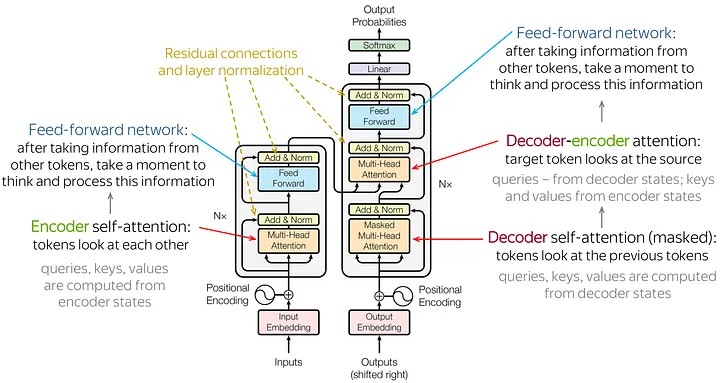
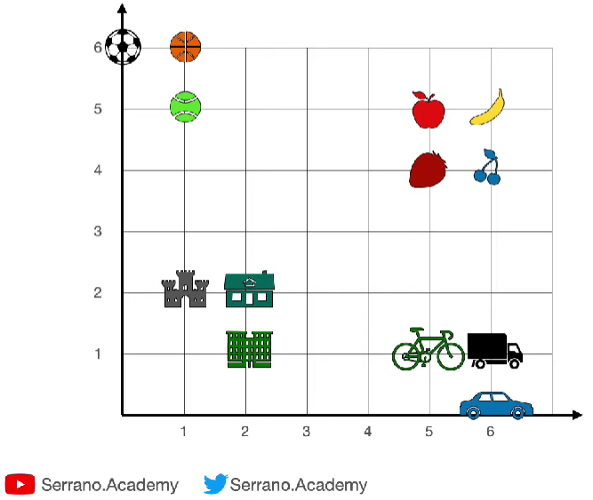
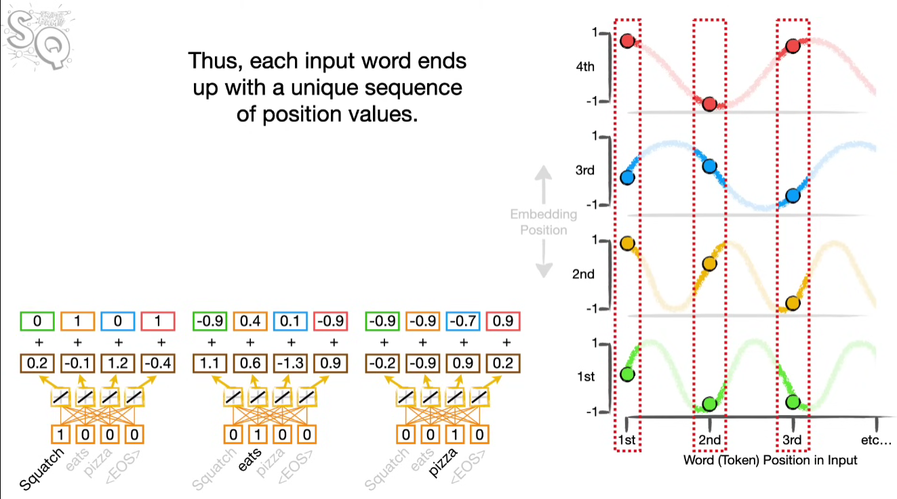
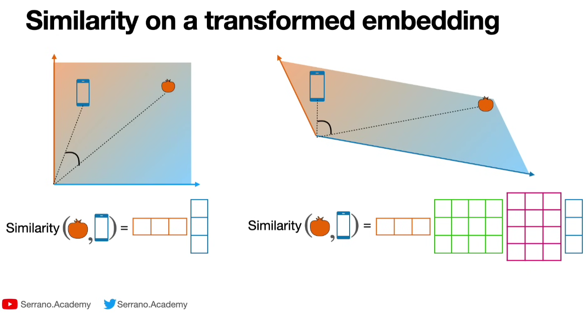
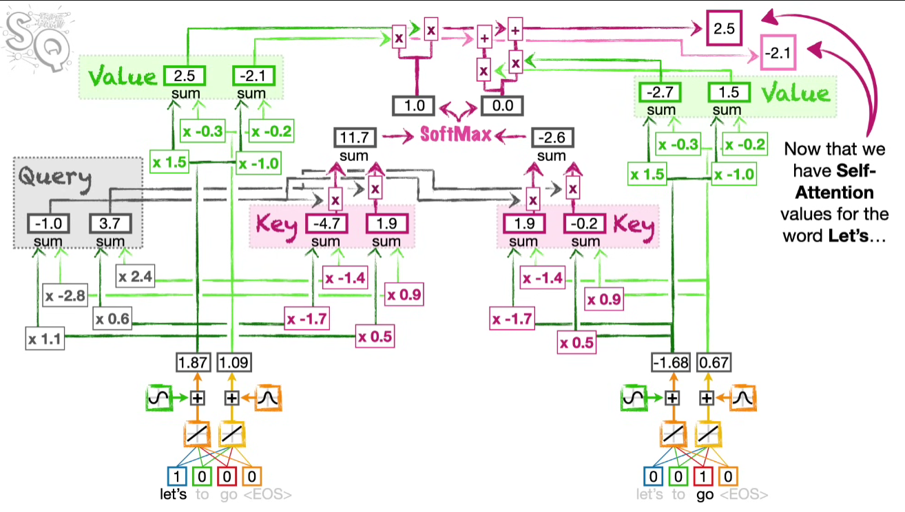

# Building a Generatively Pretrained Transformer (GPT) from Scratch.

## Introduction 

Transformers are at the core of many state-of-the-art generative models like ChatGPT. I built a Generatively Pretrained Transformer (GPT) from scratch using PyTorch and learned the transformers architecture essentials. 

I learned:
1. Transformer architecture.
2. Text encoding techniques.
3. Embeddings
4. Attention mechanism
5. Key points of transformers like residual path and layernorm
2. How to implement a Bigram Language model 
3. How to make training data for decoder-only models.


character-level prediction


This notebook follows [this Andrej Karpathy's tutorial](https://youtu.be/kCc8FmEb1nY?si=sX6u7bh1uh_UUeFv).


## <ins>Overview of Transformer Architecture</ins>



Above is a good infographic from [this article](https://medium.com/@amirhossein.abaskohi/navigating-transformers-a-comprehensive-exploration-of-encoder-only-and-decoder-only-models-right-a0b46bdf6abe).


Like ChatGPT, I'm implementing a decoder-only model. It predicts next character based on given characters for text completion. There is no encoder or cross-attention - only decoder and self-attention. It's because this model is not going to be fine-tuned. So, there is no constraints at the moment to control the behavior of the model. It will just produce whatever text that makes sense until it decides not to.


sequence-to-sequence problem


## <ins>Implementation</ins>

Watching [this video from Serrano Academy](https://www.youtube.com/watch?v=qaWMOYf4ri8&ab_channel=Serrano.Academy) and [this video from StatQuest](https://youtu.be/zxQyTK8quyY?si=sl4lknKj5G5vNnzQ) helped me understand the general overview of transformer architecture.

### *Text Tokenization/Encoding*

Text tokenization is the step to break down the text into tokens for the model to digest. In general, sophisticated tokenization methods can yield more complex outcome - it can be as easy as character-based and as complex as sentences-based or more. Here are some aspects to consider for tokenization methods:

| Token unit                               |                       Word-based                       |                           Character-based                           |
|------------------------------------------|:------------------------------------------------------:|:-------------------------------------------------------------------:|
| Vocabulary size                          |                         Larger                         |                               Smaller                               |
| Chance of getting out-of-vocabulary case |                         Higher                         |                                Lower                                |
| Preservation of semantics                |                         Higher                         |                                Lower                                |
| Use cases                                | Where the meaning is important like sentiment analysis | Where the granule information is important like spelling correction |

For the ease of implementation, I used character-based tokenization where I tokenized the text in character-level by giving each character an integer value.  The text data I used is a Shakespeare text - around 1M characters with 65 unique characters ( !$&',-.3:;?ABCDEFGHIJKLMNOPQRSTUVWXYZabcdefghijklmnopqrstuvwxyz). It's in a play format like this:

```
First Citizen:
Before we proceed any further, hear me speak.

All:
Speak, speak.

First Citizen:
You are all resolved rather to die than to famish?
```

### *Training Data*

I'll need training data that will help my model predict next character based on previous characters. The training data is created by taking a piece of text for context and separating it into inputs and targets:

```
Context: [18, 47, 56, 57, 58,  1, 15, 47, 58]

input [18]                              target: 47
input [18, 47]                          target: 56
input [18, 47, 56]                      target: 57
input [18, 47, 56, 57]                  target: 58
input [18, 47, 56, 57, 58]              target: 1
input [18, 47, 56, 57, 58,  1]          target: 15
input [18, 47, 56, 57, 58,  1, 15]      target: 47
input [18, 47, 56, 57, 58,  1, 15, 47]  target: 58
```

This set is a training batch where the context word forms a triangle at the bottom left. This is brought up again in the attention section. 

### *Embeddings*

Embedding is the bridge between natural language and computer. We associate information to words. Then, similar words will be closely associated. This method of embedding is called Word2Vec. 
[This video from Serrano Academy](https://youtu.be/OxCpWwDCDFQ?si=Ls7fFk-5NjQSfqWi) helped me understand word embeddings. In PyTorch, I can simply use `nn.Embedding`.



The above graph is a simple visual representation of embeddings, where similar words are closer to each other than non-similar words. 

### *Positional Encoding*

The position of the token is encoded in an embedding, usually by moving the token around in a set order in the embedding, so we can distinguish phrases with same tokens but in different order. There are many positional encoding methods, and one of the popular methods is to use alternating sine and cosine with different frequencies:



The above image from [StatQuest's video](https://youtu.be/zxQyTK8quyY?si=2Xfai9PE6kRFkxES&t=450) visualizes this method well. Since sines and cosines have different frequencies, we can ensure the uniqueness of their values at different spots. In this exercise, I simply used `nn.Embedding` with random numbers since any unique numbers will work. 

### *Attention Mechanism*

The context is important in interpreting a word, especially when the word is ambiguous, such as 'it' and 'that.' In transformer, context is captured using attention mechanism. Simply put, attention makes the similar words get closer in the embeddings. 

Although we already have word embeddings and positional encodings, transformer take an extra step and add more embeddings called Keys, Queries, and Values vector (implemented using `nn.Linear` in my case), forming an `Attention Head`. We can create multiple unique attention heads (sets of Keys, Queries, and Values) to create even more complex attention architecture called `Multi-Head Attention`.

Attention mechanism:

1. A Query is used to 'ask' other words for word similarity comparison. 
2. A Key is provided by each word in 'response' to the query.
3. The Query and Key similarity is calculated. Many methods are possible, and the goal is to assign more weight to similar words. 
   1. Dot product (distance between words)
   2. Cosine similarity (angle difference between words from origin)
   3. Scaled dot product (dot product / sqrt of vector length). In my implementation, I used the scaled dot product to make the gradient a unit gradient so the softmax will not be saturated and become a hot-hot vector, losing the context information from similarity calculation. 
4. Softmax the result from step 3 to convert the result into probability form. Softmax is used instead of simple average because of negative numbers.
5. Add the result from step 4 to the Value to obtain the final similarity score. 



[Math behind attention by Serrano Academy](https://youtu.be/UPtG_38Oq8o?si=HOEvo16YS0ZJxMXn) shows an intuitive and visual explanation of K, Q, and V vectors, 



And [this video from StatQuest](https://youtu.be/zxQyTK8quyY?si=w45J2WISZ7z0xhBc&t=773) shows a more detailed roles of K, Q, and V vectors in transformer. 

What I implemented is a decoder-only architecture, and decoder uses self-attention mechanism where the decoder uses its own K and Q vectors to compute attention. If we use Keys and Values from other places like an encoder, then it's called a cross-attention. 

Since decoder has to complete the text by predicting the next word based on given words, it should not know what comes in the future. Therefore, in case the given words are shorter than the `context_size`, we need to prevent the model from paying attention to empty spots by masking them with negative infinities:

```
tensor([[-1.7629, -1.3011,  0.5652,  2.1616, -1.0674,  1.9632,  1.0765, -0.4530],
        [-3.3334, -1.6556,  0.1040,  3.3782, -2.1825,  1.0415, -0.0557,  0.2927],
        [-1.0226, -1.2606,  0.0762, -0.3813, -0.9843, -1.4303,  0.0749, -0.9547],
        [ 0.7836, -0.8014, -0.3368, -0.8496, -0.5602, -1.1701, -1.2927, -1.0260],
        [-1.2566,  0.0187, -0.7880, -1.3204,  2.0363,  0.8638,  0.3719,  0.9258],
        [-0.3126,  2.4152, -0.1106, -0.9931,  3.3449, -2.5229,  1.4187,  1.2196],
        [ 1.0876,  1.9652, -0.2621, -0.3158,  0.6091,  1.2616, -0.5484,  0.8048],
        [-1.8044, -0.4126, -0.8306,  0.5899, -0.7987, -0.5856,  0.6433,  0.6303]],
       grad_fn=<SelectBackward0>)
```

Attention vector before masking. Considering the training data where the context words are located in the bottom-left triangle, the top-right triangle part should not be considered since there is no data there. 

```
tensor([[-1.7629,    -inf,    -inf,    -inf,    -inf,    -inf,    -inf,    -inf],
        [-3.3334, -1.6556,    -inf,    -inf,    -inf,    -inf,    -inf,    -inf],
        [-1.0226, -1.2606,  0.0762,    -inf,    -inf,    -inf,    -inf,    -inf],
        [ 0.7836, -0.8014, -0.3368, -0.8496,    -inf,    -inf,    -inf,    -inf],
        [-1.2566,  0.0187, -0.7880, -1.3204,  2.0363,    -inf,    -inf,    -inf],
        [-0.3126,  2.4152, -0.1106, -0.9931,  3.3449, -2.5229,    -inf,    -inf],
        [ 1.0876,  1.9652, -0.2621, -0.3158,  0.6091,  1.2616, -0.5484,    -inf],
        [-1.8044, -0.4126, -0.8306,  0.5899, -0.7987, -0.5856,  0.6433,  0.6303]],
       grad_fn=<SelectBackward0>)
```

Attention vector after masking. The non-context parts are masked away. 

```
tensor([[1.0000, 0.0000, 0.0000, 0.0000, 0.0000, 0.0000, 0.0000, 0.0000],
        [0.1574, 0.8426, 0.0000, 0.0000, 0.0000, 0.0000, 0.0000, 0.0000],
        [0.2088, 0.1646, 0.6266, 0.0000, 0.0000, 0.0000, 0.0000, 0.0000],
        [0.5792, 0.1187, 0.1889, 0.1131, 0.0000, 0.0000, 0.0000, 0.0000],
        [0.0294, 0.1052, 0.0469, 0.0276, 0.7909, 0.0000, 0.0000, 0.0000],
        [0.0176, 0.2689, 0.0215, 0.0089, 0.6812, 0.0019, 0.0000, 0.0000],
        [0.1691, 0.4066, 0.0438, 0.0416, 0.1048, 0.2012, 0.0329, 0.0000],
        [0.0210, 0.0843, 0.0555, 0.2297, 0.0573, 0.0709, 0.2423, 0.2391]],
       grad_fn=<SelectBackward0>)
```

Attention vector after softmax. Now, the attention weight is forming a probability distribution, which is a convenient form to use. 

### *Feed Forward*

The feed forward is a simple densely connected layers where the learning happens. It's made of `nn.Linear` with `ReLU` and `Dropout` components. 

### *Other important features*

#### Residual connection 

Deep neural net suffer from optimization issue due to diminishing gradient. We can mitigate this issue with [residual connection](https://arxiv.org/abs/1512.03385) where we reserve the gradient by ensuring an unobstructed 'gradient highway'. Whenever data need to be processed and transformed, we make a branch from the original path, apply the transformation, and add it back to the original path. Here, addition is used because addition distributes gradient equally in both residual and branched off paths.   

#### Layer Normalization

Layer normalization is used to stabilize the learning. Like the name suggests, the elements are normalized across each layer. Unlike the original paper's implementation, I applied normalization before the attention head, instead of after, because it's the trend now. See [this video](https://youtu.be/G45TuC6zRf4?si=EzrPZbn4d5i_BBA2) for more information on layer normalization. 

#### Token Selection Strategies

The raw output of the transformer is a discrete probability distribution over all possible tokens calculated using the softmax function. There are a few strategies we can use to produce more various output. 

* Temperature amplifies the softmax function so higher temperature will make output more random.
* Top-K limits the output to a certain number (K) of the top tokens.
* Top-p limits the output to the top tokens within a certain probability mass (p).

Check [this article](https://peterchng.com/blog/2023/05/02/token-selection-strategies-top-k-top-p-and-temperature/) for more information on temperature, k, and p.


Fine tuning 