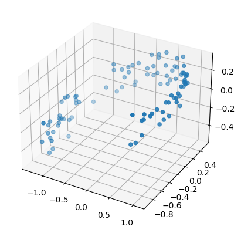
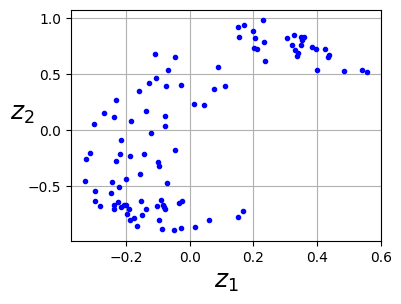
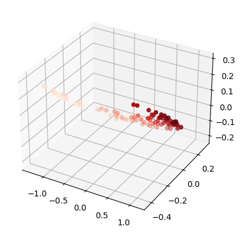
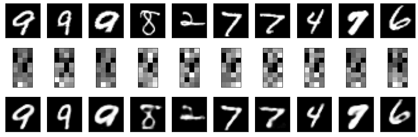
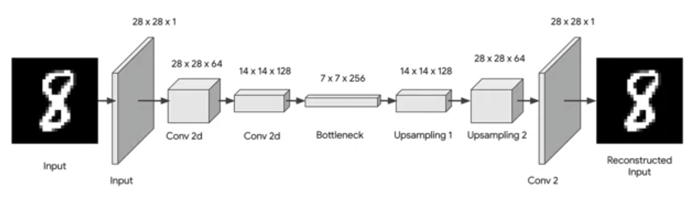
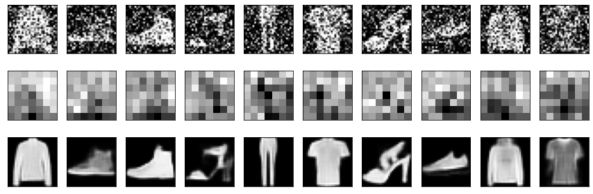

Train models to automatically encode and decode data. 

The general purpose of the encoder-decoder architecture is to teach the model how to convert data into another form. Three use examples of encoder-decoder model are shown below. More details are included in the Jupyter notebook files. 

## [Dimensionality reduction](https://github.com/Juhyung8371/AI-ML-CV-Projects/blob/main/Generative%20AI/AutoEncoder/AutoEncoder_Dimensional_Reduction.ipynb)

|  |  |  |
|:-----------------------------------------------:|:-----------------------------------------------:|:-----------------------------------------------:|
|                     Before                      |              Encoded (compressed)               |               Decoded (restored)                |

As shown above, the 3D data is compressed to 2D, and then restored to 3D. 

## [Encryption and decryption](https://github.com/Juhyung8371/AI-ML-CV-Projects/blob/main/Generative%20AI/AutoEncoder/AutoEncoder_Encryption_Decryption.ipynb)

The fact that the encoded result is only restorable with the right decoder, we can use the encoder as an encryption device and the decoder as a decryption device. 

## [Removing noise from an image](https://github.com/Juhyung8371/AI-ML-CV-Projects/blob/main/Generative%20AI/AutoEncoder/AutoEncoder_Denoising_CNN.ipynb)

The model is a simple CNN model.

By feeding images with strategically applied noises, the model can learns how to reverse them.
