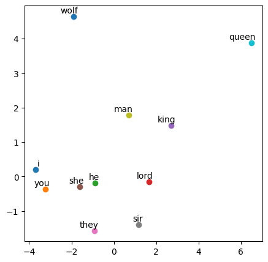

# Continuous Bag of Words (CBOW)- Word Embeddings

## Model and Result

We can represent the words as numerical vectors for computers to interpret human words. Word embeddings are one of the ways.

The CBOW technique captures the context of the word to better understand the relationship between words (syntactic and semantic structures).

Word vectors can be a building block of many Natural Language Processing tasks.

This is the structure of the model:

1. The Embedding layer enables us to convert each word into a fixed length vector of defined size. The fixed length of word vectors helps us to represent words in a better way, along with reduced dimensions. It's more efficient than one-hot encoding since this will take up much less space.

2. GlobalAveragePooling1D layer averages out the embedding to get the context of the context words.

3. Finally, a Dense layer with a softmax activation function is used to output the result.

We can extract some information from the result above. 

1. 'man' and 'king' are close.
2. Pronouns (ex. i, he, she...) are clustered at the left-bottom corner. 
3. 'wolf' is by itself at the left-top corner
4. 'queen' is by itself at the right-top corner

We have to be careful that this result is simplified by PCA.

## Discussion

There are a few challenges associated with CBOW, as explained [here](https://spotintelligence.com/2023/07/27/continuous-bag-of-words/#How_can_you_overcoming_challenges_and_limitations_associated_with_the_CBOW_model):

1. Handling Out-of-Vocabulary (OOV) Words
   - Subword embedding, where the unknown word is split into pieces for inference, can be used.
2. Polysemy and Homonymy
   - CBOW treats each word as a single entity with a single meaning. More context-sensitive word embedding models like BERT are developed.
3. Data Sparsity
   - Obtaining high-quality word embeddings with CBOW can be challenging with limited resources. To mitigate data sparsity, researchers may resort to transfer learning, fine-tuning pre-trained embeddings from larger corpora on their specific dataset or domain. 
4. Context Window Size Selection
   - A small window may not provide sufficient context information, while a large window may introduce noise and dilute the relevant information. The optimal context window size often depends on the specific NLP task and the dataset’s characteristics. Experimentation and hyperparameter tuning are essential.
5. Scalability
    - CBOW can be computationally intensive, especially for large vocabularies and datasets. Training a CBOW model on massive text corpora may require significant computational resources and time. To overcome this challenge, researchers may consider using word2vec libraries like Gensim, which efficiently implement CBOW and other word embedding techniques that can leverage multi-core processors and distributed computing.

