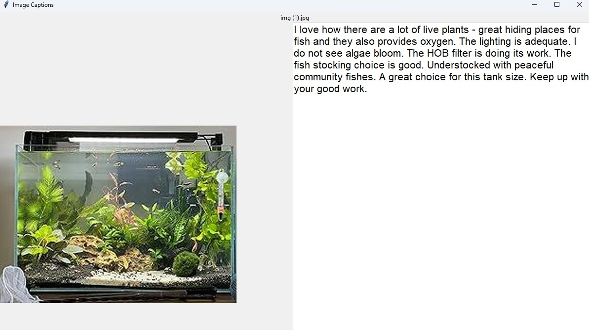

# Fish Tank Doctor - Fish Tank Health Diagnosis AI

# Introduction

Maintaining a balanced environment within a fish tank is an intricate task, often presenting challenges for both novice and experienced aquarists. Fish tank care encompasses a spectrum of challenges, as it requires a keen understanding of factors such as water quality, species compatibility, and overall tank conditions. Inexperienced hobbyists may struggle to identify subtle signs of issues in their fish tanks.

I developed the Fish Tank Doctor, an AI-powered fish tank diagnosis tool, to empower inexperienced fish keepers to overcome these challenges with precision and ease. Leveraging the capabilities of machine learning and computer vision, this tool stands as a reliable companion in the quest for fish-keeping mastery. It can offer a comprehensive analysis of visual cues and provide tailored insights into the conditions of the tank.

# Data Collection and Data Ethics

In the development of the Fish Thank Doctor, a paramount consideration was the ethical and responsible collection of data. Recognizing the sensitive nature of user-generated content and the importance of privacy, I meticulously adhered to ethical principles throughout the data-gathering process. There are many resources about data ethics online like [this](https://www.intechopen.com/chapters/1121510), [this](https://medium.com/analytics-vidhya/data-ethics-in-artificial-intelligence-machine-learning-72467b9c70f3), [this](https://www.dataversity.net/machine-learning-data-governance-and-data-ethics/), and [this](https://online.hbs.edu/blog/post/data-ethics). 

I needed two types of data images of various fish tank setups and corresponding tank diagnoses in text. 

First, raw images were obtained through web-scraping. Here are the [guidelines](https://blog.apify.com/is-web-scraping-legal/) I follow to conduct ethical web scraping. 

* The data scraper acts as a good citizen of the web and does not seek to overburden the targeted website.
* The information copied was publicly available and not behind a password authentication barrier.
* The information copied was primarily factual in nature, and the taking did not infringe on the rights — including copyrights — of another.
* The information was used to create a transformative product and was not used to steal market share from the target website by luring away users or creating a substantially similar product.

Second, tank diagnosis data was obtained through my work and voluntary participation from online fish-keeping community members. Here are some data ethics practices I employed:

1. User Consent and Anonymity:
   
    Explicit consent was obtained before any data collection began to ensure voluntary participation. All collected data is anonymized by removing any personally identifiable information from the dataset to preserve the subject's privacy. They were also informed about their right to retract their shared data at anytime. 
   
2. Transparency and Accountability:
   
    A commitment to transparency was maintained throughout the data collection process. Data subjects were informed about the purpose of data collection, the types of information gathered, the intended use of data, and the tool's functionality.
    
3. Inclusivity and Diversity:
   
    Striving for a representative dataset, the collection process was designed to be inclusive of various fish tank setups. This approach not only promotes diversity in the dataset but also prevents biases, ensuring that the Fish Tank Doctor delivers reliable results across various scenarios.



To streamline the image captioning, I developed a GUI, `caption_gui.py`, to easily save and load the captions to a CSV file format. The format is HuggingFace's `ImageFolder` caption dataset generation method's metadata format, which is described [here](https://huggingface.co/docs/datasets/main/en/image_dataset#image-captioning):

```
file_name,additional_feature
0001.png,This is a first value of a text feature you added to your images
0002.png,This is a second value of a text feature you added to your images
0003.png,This is a third value of a text feature you added to your images
```


