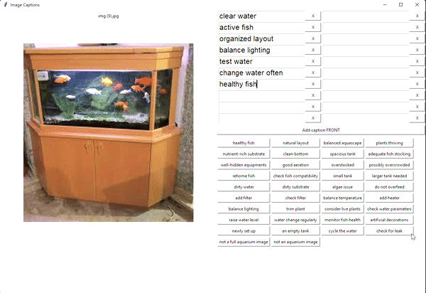
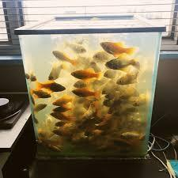

# Fish Tank Doctor - Fish Tank Health Diagnosis AI (work in progress)

# <ins>Introduction</ins>

Maintaining a balanced environment within a fish tank is an intricate task, often presenting challenges for both novice and experienced fish keepers. Fish tank care encompasses a spectrum of challenges, as it requires a keen understanding of factors such as water parameters, species care, and overall tank maintenance. Inexperienced hobbyists may struggle to identify subtle signs of issues in their fish tanks.

I developed the Fish Tank Doctor, an AI-powered fish tank diagnosis tool, to empower inexperienced fish keepers to overcome these challenges with precision and ease. Leveraging the capabilities of machine learning and computer vision, this tool stands as a reliable companion in the quest for fish-keeping mastery. It can offer a comprehensive analysis of visual cues and provide tailored insights into the conditions of the tank.

# <ins>Model Selection and Literature Review</ins>

The ultimate goal of this project is to make a system that takes in an image of aquarium as the input and produces comprehensive text feedback to help improve the user's fish husbandry skills. A suitable solution would be an image captioning model. Image captioning is a subcategory of the vision-language task. In general, vision-language models (VLM) are asked to perform certain tasks with given image inputs, and they output natural language text. Examples of tasks include image captioning, visual question answering, object detection, visual generation, visual summarization, etc. 

A VLM typically consists of 3 key elements: 
- an image encoder
- a text encoder
- a strategy to fuse information from the two encoders

1. **[Show and Tell](https://arxiv.org/abs/1502.03044)** 2018:
   - The image features are extracted using a Convolutional Neural Network (CNN) as an encoder, and a Long Short-Term Memory (LSTM) network is employed as a decoder to generate the sequential captions. 
   - Similarly, in [Show, Attend and Tell](https://arxiv.org/abs/1502.03044), an attention mechanism is used to dynamically focusing on different parts of the image, improving the model's ability to capture finer details. 
   - I implemented a similar architecture [here](https://github.com/Juhyung8371/AI-Projects/tree/main/Generative%20AI/5%20Image%20Captioning%20-%20Visual%20Attention) using InceptionResNetV2 and visual attention.

2. **[Image Transformer](https://arxiv.org/abs/1802.05751) 2018:**
   - The authors extend the transformer architecture, initially designed for sequence-to-sequence tasks in NLP, to process images. The key idea is to treat the image as a 1D sequence of fixed-size patches, similarly to how words in a sentence are treated. 
   - It showcases the effectiveness of transformer-based architectures on image-based tasks, beyond traditional tasks like NLP.

3. **[ViLBERT](https://arxiv.org/abs/1908.02265) 2019**:
   - ViLBERT (Vision-and-Language Bidirectional Encoder Representations from Transformers) aims to learn task-agnostic visiolinguistic representations that can be fine-tuned for various downstream tasks like image captioning and VQA. 
   - It extends BERT architecture to a multi-modal two-stream model, processing both visual and textual inputs in separate streams that interact through co-attentional transformer layers.
   - The model uses Faster [R-CNN (2018)](https://arxiv.org/abs/1506.01497) to extract regional visual features.
   - This work is a significant milestone in bridging the gap between image and text.

4. **[An Image is Worth 16x16 Words: Transformers for Image Recognition at Scale](https://arxiv.org/abs/2010.11929) (a.k.a Vision Transformer) 2020**:
   - Vision Transformer (ViT) is similar to 'Image Transformer' in the sense they both used transformer to analyze the image, but it takes a different approach by treating the entire image as a sequence of fixed-size non-overlapping patches, aiming to capture both local and global spatial dependencies in the image.
   - ViT did not replace CNNs but rather provided an additional tool in the toolbox for researchers.
   - According to this Medium article [CNNs vs ViT](https://medium.com/@faheemrustamy/vision-transformers-vs-convolutional-neural-networks-5fe8f9e18efc), ViT could outperform CNNs given large dataset, but it is much more resource-intensive process than CNNs. 

5. **[SOHO](https://arxiv.org/abs/2104.03135) 2021**:
   - Seeing Out of tHe bOx (SOHO) proposes a solution to common limitations of region-based image features:
     - It can detect objects but may not capture the context, which can lead to misunderstandings. 
     - Object detection is limited to its number of pre-defined features in the model.
     - The image detection model may suffer from data problem such as low quality, noise, over-sampling, and reliance on a large amount of annotated data. 
   - SOHO leverages a trainable CNN visual encoder (ResNet), which takes the whole image as input and produces visual features in image-level instead of region-level. 
   - Then it assigns visual words from the Visual Dictionary to different regions or segments within the image. The model learns to predict object boundaries based on the distribution of visual words in the image, enabling more accurate and fine-grained object detection results.
   - SOHO represents objects in images using object boundaries, facilitating more accurate and context-aware visual-text operations.

[//]: # ()
[//]: # (https://huggingface.co/blog/vision_language_pretraining)

[//]: # ()
[//]: # (https://encord.com/blog/vision-language-models-guide/)

[//]: # ()
[//]: # (https://arxiv.org/pdf/2202.10936.pdf A Survey of Vision-Language Pre-Trained Models)

[//]: # ()
[//]: # (Empirical data:)

[//]: # ([paper with code image captioning comparison]&#40;https://paperswithcode.com/task/image-captioning&#41;)

[//]: # ()
[//]: # (Microsoft)

[//]: # ([GIT]&#40;https://arxiv.org/abs/2205.14100&#41;)

[//]: # ([Hugging Face's GIT-bBase implementation]&#40;https://huggingface.co/docs/transformers/model_doc/git&#41;)

[//]: # (GIT-Base is 129M parameters)

[//]: # ()
[//]: # (SalesForce)

[//]: # ([BLIP-2]&#40;https://arxiv.org/abs/2301.12597&#41;)

[//]: # ([Hugging Face's BLIP-2 implementation]&#40;https://huggingface.co/docs/transformers/model_doc/blip-2&#41;)

[//]: # (BLIP-2 2.7B parameters)

# <ins>Data Collection</ins>

## Data Pipeline

1. Image collection
   * Automate it using a custom web-scraping code. 
   * Future work: Train a GAN model to generate images. 
2. Image filtering and concise captioning
   * Use GPT-4 Vision for initial image captioning task. 
   * The request prompt is engineered to produce aquarium maintenance insights in a concise and consistent list format to minimize the output token cost while maximizing the output information. 
   * Prompt: `"You are an expert aquarist. List good maintenance signs and potential improvements for the aquarium in this image using under five words each, * as a bullet point, and without headers."`
   * Sometime the AI will say that they can't help me or have trouble with captioning task. I can add a prompt like `"Say 'STOPPED' if the image is not about aquariums or if you can't help me with this task."` but that requires a lot of tokens. Instead, I can just stop the AI mid-generation with the stop-sequence parameter, and filter out those incomplete captions with other scripts (detect missing new lines or bullet points).
3. Combine with real-world data
   * Combine the real-world data (ones ethically collected and ones produced myself) with the synthetic ones to ensure data diversity and enhance realism in data. 
4. Caption elaboration
   * I let GPT-3.5 Turbo, a cheaper and dialog fine-tuned model, elaborate on the list from image captioning task. 
   Prompt: `"You are an expert aquarist. In a paragraph, elaborate on this aquarium:" + the short caption`
5. Human check
   * Check and fix for any errors or shortcomings in the captions before augmenting them to produce more data. 
6. Data augmentation 
   * Augment the image using image processing techniques like rotation, flip, zooming, translation, noise addition, cropping, brightness adjustment, and contrast adjustment. 
   * For text paraphrasing, use GPT-3.5 Turbo again because it's very good at text generation tasks like paraphrasing.  
7. Human check
   * The final check for quality assurance. 



In addition, to streamline the manual image captioning part, I developed a GUI, `caption_gui.py`, to easily save and load the captions to a CSV file format. This tool automates most of the tedious work of file organization and formatting so the caption writers can focus on producing quality captions. 

The save format is HuggingFace's `ImageFolder` caption dataset generation method's metadata format, which is described [here](https://huggingface.co/docs/datasets/main/en/image_dataset#image-captioning):

```
file_name,additional_feature
0001.png,This is a first value of a text feature you added to your images
0002.png,This is a second value of a text feature you added to your images
0003.png,This is a third value of a text feature you added to your images
```

## Data Ethics

In the development of the Fish Thank Doctor, a paramount consideration was the ethical and responsible collection of data. Recognizing the sensitive nature of user-generated content and the importance of privacy, I meticulously adhered to ethical principles throughout the data-gathering process. There are many resources about data ethics online like [this](https://www.intechopen.com/chapters/1121510), [this](https://medium.com/analytics-vidhya/data-ethics-in-artificial-intelligence-machine-learning-72467b9c70f3), [this](https://www.dataversity.net/machine-learning-data-governance-and-data-ethics/), and [this](https://online.hbs.edu/blog/post/data-ethics). 

I needed two types of data images of various fish tank setups and corresponding tank diagnoses in text. 

First, raw images were obtained through web-scraping. Here are the [guidelines](https://blog.apify.com/is-web-scraping-legal/) I follow to conduct ethical web scraping. 

* The data scraper acts as a good citizen of the web and does not seek to overburden the targeted website.
* The information copied was publicly available and not behind a password authentication barrier.
* The information copied was primarily factual in nature, and the taking did not infringe on the rights — including copyrights — of another.
* The information was used to create a transformative product and was not used to steal market share from the target website by luring away users or creating a substantially similar product.

Second, tank diagnosis data was obtained through my work and voluntary participation from online fish-keeping community members. Here are some data ethics practices I employed:

1. User Consent and Anonymity:
   
    Explicit consent was obtained before any data collection began to ensure voluntary participation. All collected data is anonymized by removing any personally identifiable information from the dataset to preserve the subject's privacy. They were also informed about their right to retract their shared data anytime. 
   
2. Transparency and Accountability:
   
    A commitment to transparency was maintained throughout the data collection process. Data subjects were informed about the purpose of data collection, the types of information gathered, the intended use of data, and the tool's functionality.
    
3. Inclusivity and Diversity:
   
    Striving for a representative dataset, the collection process was designed to be inclusive of various fish tank setups. This approach not only promotes diversity in the dataset but also prevents biases, ensuring that the Fish Tank Doctor delivers reliable results across various scenarios.

## Data Collection Automation and Synthetic Data

Data collection is one of the most resource-intensive step of machine learning project. Data scientists spend around 80% of their time on preparing and managing data for analysis according to [this Forbes article](https://www.forbes.com/sites/gilpress/2016/03/23/data-preparation-most-time-consuming-least-enjoyable-data-science-task-survey-says/?sh=79dcbd16f637). Privacy/copyright concern is another hurdle. I attempt to solve those issues and streamline the data collection process with synthetic data. Synthetic data in machine learning refers to artificially generated data that mimics the characteristics of real-world data. 

| Advantages of Synthetic Data |                                                                                       Note                                                                                        |
|:----------------------------:|:---------------------------------------------------------------------------------------------------------------------------------------------------------------------------------:|
|         More Ethical         |         Most importantly, it doesn’t expose sensitive data or breach copyright since it's made up. Therefore, it also removes the regulatory hurdles of collecting them.          |
|        More Flexible         |                                        It allows organizations to share or distribute datasets without compromising sensitive information.                                        |
|      Faster and Cheaper      | By minimizing regulatory hurdles, data collection time, data cleaning time, etc., one can quickly obtain a large amount of data at a lower cost, leading to greater productivity. |
|    Better Quality Control    |                     Having the full control over the synthesis process, you can make changes and test easier such as adjusting data diversity and complexity.                     |


| Disadvantages of Synthetic Data |                                                                                                          Note                                                                                                          |                                                                                           Potential Solutions                                                                                            |
|:-------------------------------:|:----------------------------------------------------------------------------------------------------------------------------------------------------------------------------------------------------------------------:|:--------------------------------------------------------------------------------------------------------------------------------------------------------------------------------------------------------:|
|         Limited Realism         | Synthetic data may not perfectly capture the complexities and nuances of real-world scenarios. Creating high-quality, complex synthetic data requires a deep understanding of the data distribution and relationships. |                                                                         Combine synthetic data with real data in a balanced way.                                                                         |
|  Risk of Overfitting and Bias   |                                                   Over-reliance on synthetic data can lead to overfitting and bias, since the data is created by a man-made machine.                                                   |                   Employ bias detection and mitigation technique like bias metrics, bias indicator, regularization, over/under-sampling, etc. Also, fine-tune it with real-world data.                   |
|  Privacy and Security Concern   |                          If the synthetic data generation process doesn't adequately mimic the real data, it could unintentionally reveal information about the original, sensitive dataset.                           | Regularly monitor the model to identify and address any potential privacy or security vulnerabilities. Anonymize the original data and adhere to legal and ethical guidelines when using synthetic data. |

### Example of Caption Generation



This is an example image of an overstocked aquarium. 

|   Captioner    |                                                   Concise Caption                                                   |                                                                                                                                                                                                                                                                                                                                                                                                                                                                                                                                               Elaborated Caption                                                                                                                                                                                                                                                                                                                                                                                                                                                                                                                                                |
|:--------------:|:-------------------------------------------------------------------------------------------------------------------:|:---------------------------------------------------------------------------------------------------------------------------------------------------------------------------------------------------------------------------------------------------------------------------------------------------------------------------------------------------------------------------------------------------------------------------------------------------------------------------------------------------------------------------------------------------------------------------------------------------------------------------------------------------------------------------------------------------------------------------------------------------------------------------------------------------------------------------------------------------------------------------------------------------------------------------------------------------------------------------------------------------------------------------------------------------------------------------------------------------------------:|
| OpenAI GPT API |          Overstocked, Water change needed, More filtration, Bigger habitat, Algae control, Plant diversity          | It seems like your aquarium is facing a few challenges that need attention. First, having an overstocked aquarium can lead to issues like inadequate space for the inhabitants and increased waste, impacting water quality. To address this, prioritize a gradual rehoming of some fish or other aquatic creatures to achieve a balanced ecosystem. Additionally, regular water changes are crucial to maintain water quality, so schedule these consistently. Considering the need for more filtration, upgrading your filtration system or adding supplementary filtration devices can improve water circulation and quality. A larger habitat would not only accommodate the current residents better but also allow for better territorial separation. Introduce algae-eating organisms or adjust lighting to control algae growth effectively. Lastly, enhance plant diversity as they contribute to a healthier ecosystem by absorbing excess nutrients and providing hiding spots. Gradual changes and careful monitoring will help transform your aquarium into a thriving, well-balanced environment. |
|     Human      | Overstocked, Water change needed, Filter needed, Bigger tank needed, Algae, Bacterial bloom, Stay away from window. |                                                                                                                                                                                                                         This tank is so overcrowded with goldfish that I cannot even count their numbers. Rehome the fish, or you will need a pond to keep them all. Also, please do not put the tank under direct sunlight as it can cause algae bloom. The water looks foggy, so the fish are probably suffering from algae bloom already, but it is more likely a bacterial bloom due to too much fish waste from the fish. As an immediate remedy, do a 50% water change daily until the water clears. Otherwise, those fish will die from ammonia poisoning. Where is the filter? This tank will probably need like three 30 gallon rated sponge filters to keep the fish alive."                                                                                                                                                                                                                          |

Human and GPT has their pros and cons. Human is a lot better at visual analysis and more robust in dealing with edge cases like unrelated input images. GPT is better at elaborating on Concise Caption, producing more consistent and knowledgeable text response. For example, GPT says suggests enhancing the plant diversity when there is no plant to begin with, and the tone of human's text is a bit aggressive for a helpful assistant. Therefore, the most efficient way to produce the real-world caption is to let human analyze the image and GPT elaborate on it. 

### Example of Data Augmentation

* Augment the image using image processing techniques like rotation, flip, zooming, translation, noise addition, cropping, brightness adjustment, and contrast adjustment. 
* For text paraphrasing, use GPT-3.5 Turbo again because it's very good at text generation tasks like paraphrasing.  


[//]: # ()
[//]: # (https://cameronrwolfe.substack.com/p/the-story-of-rlhf-origins-motivations history)

[//]: # ()
[//]: # (https://encord.com/blog/guide-to-rlhf/)

[//]: # ()
[//]: # (https://huggingface.co/blog/rlhf)

[//]: # ()
[//]: # (https://www.linkedin.com/advice/0/how-can-you-effectively-evaluate-nlp-model-image automatic metrics)
