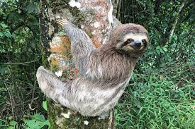

# Image Caption Generation with Visual Attention

## Introduction

The goal of this project is to create an image captioning model that can accurately describe the highlights of the image in a way that human would. For example, the generated caption for the below image might be, "Some people are playing basketball."


I utilized an attention-based encoder-decoder model to convert an image into the corresponding caption. The model architecture is referenced from [Show, Attend and Tell: Neural Image Caption Generation with Visual Attention](https://arxiv.org/abs/1502.03044). 

## Learning Outcome

1. Created an image captioning model using Keras, which involved encoder, decoder, and predictor.
1. Learned the key concepts of visual attention, and combined it with a text generation model. 
1. Loaded the image and caption data from COCO dataset and preprocessed them using techniques like normalization and tokenization.
1. Utilized Keras Functional API to reuse the layers and the weights various models.

## Data Preparation

I used COCO captions dataset. This dataset contains images, bounding boxes, labels, and captions from COCO 2014, split into the subsets defined by Karpathy and Li (2015) and takes care of some data quality issues with the original dataset.

The data come in following format:

```
FeaturesDict({
    'captions': Sequence({
        'id': int64,
        'text': string,
    }),
    'image': Image(shape=(None, None, 3), dtype=uint8),
    'image/filename': Text(shape=(), dtype=string),
    'image/id': int64,
    'objects': Sequence({
        'area': int64,
        'bbox': BBoxFeature(shape=(4,), dtype=float32),
        'id': int64,
        'is_crowd': bool,
        'label': ClassLabel(shape=(), dtype=int64, num_classes=80),
    }),
})
```

Here I preprocess the dataset:
- Text processing:
  1. Fetch and process the caption
  1. Add special tokens to represent the starts (`<start>`) and the ends (`<end>`) of sentences to give the encoder-decoder model a sense of sentence structure. 
  1. Transform the text captions into integer sequences using the [TextVectorization](https://www.tensorflow.org/api_docs/python/tf/keras/layers/TextVectorization):
      * Override the `standardize` paramter with a custom function to preserve < and > characters for the custome tokens `<start>` and `<end>`.
- Image processing:
  1. Resize image to (299, 299) shape, which is the requirement for the feature extractor [InceptionResNetV2](https://www.tensorflow.org/api_docs/python/tf/keras/applications/inception_resnet_v2/InceptionResNetV2)
  1. Normalize the image pixel values from [0, 255] to [0, 1]
- Return image(`image_tensor`) and captions(`captions`) dictionary.


## Model Architecture

### Attention Head

The decoder uses attention to selectively focus on parts of the input sequence.
The attention takes a sequence of vectors as input for each example and returns an "attention" vector for each example.

Let's look at how this works:


Where:

* $s$ is the encoder index.
* $t$ is the decoder index.
* $\alpha_{ts}$ is the attention weights.
* $h_s$ is the sequence of encoder outputs being attended to (the attention "key" and "value" in transformer terminology).
* $h_t$ is the decoder state attending to the sequence (the attention "query" in transformer terminology).
* $c_t$ is the resulting context vector.
* $a_t$ is the final output combining the "context" and "query".

The equations:

1. Calculates the attention weights, $\alpha_{ts}$, as a softmax across the encoder's output sequence.
2. Calculates the context vector as the weighted sum of the encoder outputs.

Last is the $score$ function. Its job is to calculate a scalar logit-score for each key-query pair. There are two common approaches:


This exercise implements Luong-style attention using pre-defined `layers.Attention`.

### Training Model


Above diagram shows the training model architecture. 

The decoder's job is to generate predictions for the next output token.

1. The decoder receives current word tokens as a batch.
1. It embeds the word tokens to `ATTENTION_DIM` dimension.
1. GRU layer keeps track of the word embeddings, and returns GRU outputs and states.
1. Luong-style attention attends over the image encoder's ([InceptionResNetV2](https://www.tensorflow.org/api_docs/python/tf/keras/applications/inception_resnet_v2/InceptionResNetV2)) output feature by using GRU outputs as a query.
1. The attention outputs and GRU outputs are added (skip connection), and normalized in a layer normalization layer.
1. It generates logit predictions for the next token based on the GRU output.

I defined layers in Keras Functional API so that I can reuse the layers and the weights in the predictor model, too.

### Captioning Model

Once the layers are trained, I can use them to create a captioning model. Unlike training, predicting will take the GRU states and the predicted word from the last step.

1. Initialize the GRU states as zero vectors.
1. Preprocess an input image, pass it to the encoder, and extract image features.
1. Setup word tokens of `<start>` to start captioning.
1. In the for loop, we
    - pass word tokens (`dec_input`), GRU states (`gru_state`) and image features (`features`) to the prediction decoder and get predictions (`predictions`), and the updated GRU states.
    - select Top-K words from logits, and choose a word probabilistically so that we avoid computing softmax over VOCAB_SIZE-sized vector.
    - stop predicting when the model predicts the `<end>` token.
    - replace the input word token with the predicted word token for the next step.

## Result


```
baseball players on the field getting ready together in the field.
a baseball pitcher throwing a baseball while another boy watches.
a couple of men standing on a baseball field.
a group of baseball players playing baseball in a baseball field.
a baseball player hitting the ball with a batter.
```
The first image is well-captioned.


```
a man riding on top of a wave in the ocean.
a person that surfboard in the ocean with a surf board.
a man riding a kiteboard over a body of water.
a beautiful young woman riding a boogie board on a wave.
a surfer seemed to ride a wave on a wave.
```
The second image is well-captioned, too. The model got confused about the gender of the surfer, but it grasped the main idea of the image.


```
two girls are holding a sheep next to a truck.
a woman petting a teddy bear with a bear.
a woman in denim shirt opening a dog with a leash.
a woman holding a teddy bear walking down a sidewalk.
a woman standing next to a small goat.
```
This result is not too accurate. So far, the model seems to perform better in classifying human than anything else.


```
a couple of plates of food on a table.
a plate of food with some fruit on them.
a plate topped with waffles sliced up half banana next to berries.
a couple of plates topped hot dogs with a cut in half lemon.
a white table topped with plates and dishes full of food.
```

The model can tell the image contains food, but it couldn't reliably distinguish the type of food. When I only trained the model for 1 epoch, it thought the corndogs were submarine. Since 3 epochs allows it to tell that this is food, I believe more training will increase the accuracy.



```
a very tall basket that is in the grass.
a yellow and green train that is sitting in the middle of a flower.
a couple of men on top of a green field.
a couple of yellow frosted chairs and a yellow banana.
a couple of men standing on top of a table holding a yellow frisbee.
```

I tried an image smaller than the input size (299, 299), and the sloth in the image is well-camouflaged with the white tree. The model was very confused, and couldn't produce any useful captions.

## Discussion

Despite the short training time (~ 1 hour), the model can identify and highlight some major components in the images. I noticed that model worked better with images with fewer information (patterns, objects, colors, etc.). There are some grammatical errors in the captions, but the meaning is still understandable.