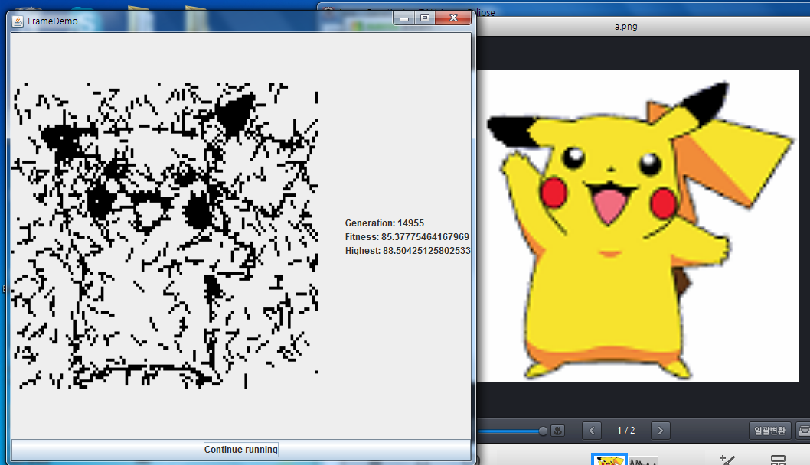

# Drawing Image with Genetic Algorithm

The goal of this project is to use a genetic algorithm to reproduce an image. 

This flowchart from [MathWorks](https://www.mathworks.com/help/gads/what-is-the-genetic-algorithm.html) summarizes the idea of a genetic algorithm.

1. The initial population is created. Their DNAs are all random.
2. Score population.
3. Choose which entities will pass down their DNAs. Usually, the entities that performed well will be chosen.
4. Produce new batches of DNAs based on the ones from Step 3.
5. Introduce some mutations in DNA for variance. This helps the algorithm to escape the local maxima.
6. Combine the populations from Step 4 and 5, and go back to Step 2.

In this project, DNA consists of Genes. Genes are the lines that create the target image. Genes consist of 4 numbers: x coordinate, y coordinate, line width, and line height. With the right combination of lines, the result can look like below:

## Discussion

Some improvements can be made:

1. Hyperparameter tuning: I can tune some parameters, such as the number of lines, maximum line length, etc., to achieve a better result.
2. Different crossover and mutation methods: I can choose which DNA will be passed down more strategically. Also, I can modify the crossover algorithm so I can make sure meaningful changes are happening instead of total random ones.
