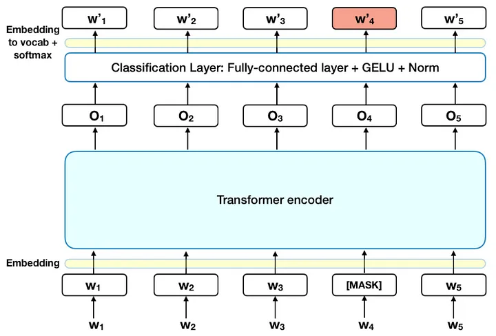
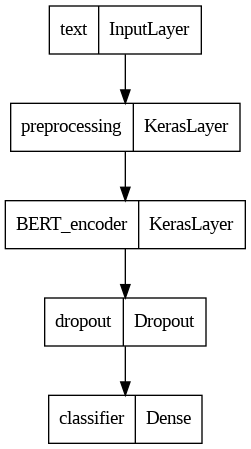
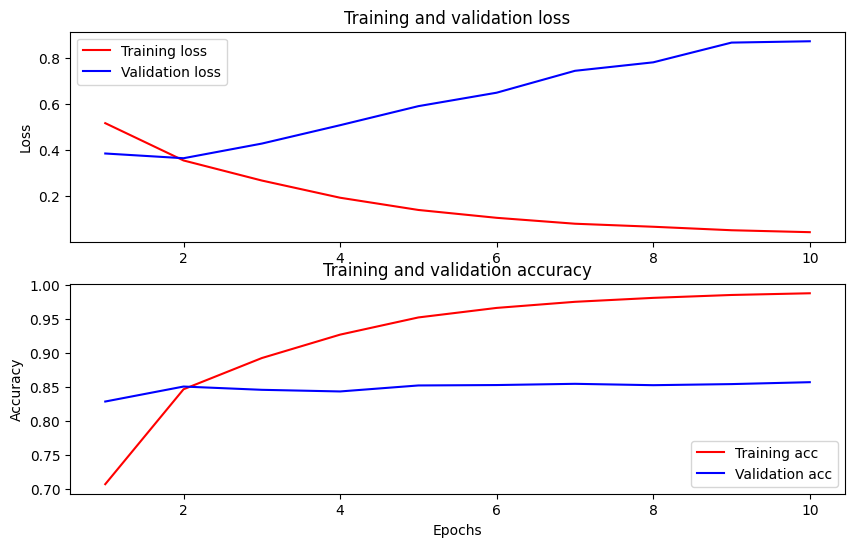

# Movie Review Sentiment Analysis With BERT

## Introduction

This project aims to learn how to classify movie reviews based on their sentiments using the BERT model. 

From this exercise, I learned:
1. About the BERT model - its characteristics and architecture.
2. How to preprocess data for BERT.
3. How to load pre-trained BERT models from the TensorflowHub.
4. How to build a model for sentiment analysis using BERT and fine-tune it.
5. How to combat overfitting in NLP problems.

The tutorial I followed is available at the [TensorFlow’s website](https://www.tensorflow.org/text/tutorials/text_generation)

## What is the BERT?



[[Image source]](https://towardsdatascience.com/bert-explained-state-of-the-art-language-model-for-nlp-f8b21a9b6270)

Introduced in 2018 by Google, the Bidirectional Encoder Representations from Transformers (BERT) model is a pre-trained natural language processing (NLP) model based on transformer architecture. 

Here are some key concepts:

1. Bidirectional Context:

   Unlike earlier models that processed text in one direction (left-to-right or right-to-left), BERT considers both directions. This bidirectional context allows the model to understand the meaning of a word based on its surrounding words from both sides.

2. Transformer Architecture:

   BERT utilizes the transformer architecture, which employs self-attention mechanisms. It enables the model to efficiently capture relationships and dependencies between words by weighing the relative importance of words against each other. The key advantage of the transformer against RNNs, a traditional NLP model choice, is their ability to capture longer dependencies, thanks to the residual connection that keeps the learning gradient from vanishing. 
  
3. Pre-training: 

    BERT is pre-trained on a large corpus of text data (Wikipedia (~2.5B words) and Google’s BooksCorpus (~800M words)) using the following techniques: 
    Masked Language Model (MLM):
    * The model learns how to fill in the blank by using the context in the sequence, like words and their positions. To be more specific, 15% of the words in a sequence are replaced with a [MASK] token.
    Next Sentence Prediction (NSP)
    * The model learns the relationship between sentences by classifying whether one sentence can follow another.

    The large amount of training data combined with the unsupervised pre-training helps BERT grasp the nuances and complexities of language. Various-sized BERT models are available for platforms with different computing power.

4. Fine-tuning:

    The pre-trained BERT model can be fine-tuned for more specific tasks like sentiment analyzer, spam detector, chatbot, etc. 

Check [this Huggin Face article](https://huggingface.co/blog/bert-101) and [this Medium article](https://towardsdatascience.com/bert-explained-state-of-the-art-language-model-for-nlp-f8b21a9b6270) about the BERT model as well. 

## Data and Model

I used the 50k movie reviews from the Internet Movie Database. This is divided into a 25k train set, a 25k test set, and a 5k validation set. Each data consists of a review (string) and label (0 for negative and 1 for positive). 

The pre-trained BERT model and its data preprocessor are loaded from the TensorFlow hub. For speed matter, I used a small BERT model with 4 layers, 512 hidden units, and 8 attention units.



I used the Adam optimizer with a 3e-5 learning rate and trained the model for 10 epochs. 

## Result

### Outputs

```
input1: this is such an amazing movie! : score: 0.999664
input2: The movie was great!           : score: 0.995424
input3: The movie was meh.             : score: 0.995758
input4: The movie was okish.           : score: 0.002597
input5: The movie was terrible...      : score: 0.000022
input6: I loved how the movie was nothing like how it was advertized! I wonder where they spent the $30M budget. : score: 0.998351
input7: The movie was nothing like how it was advertized! I wonder where they spent the $30M budget. : score: 0.000018
input8: I regret not watching this movie sooner. This movie is underrated. : score: 0.000147
input9: asdfasdfgasdggfd ag dsfsdfasdf : score: 0.918733
input10: Oh, no. Help me, I can't stop watching this movie over and over. : score: 0.000145
```

These are my observations:
1. Shorter and more straightforward phrases are often accurately classified (input 1 ~ 5).
2. A sign of overfitting is observed in certain words. Inputs 6 and 7 are the same negative reviews - I added the word 'loved' in a sarcastic way to test whether the model can catch the nuance from reading the second sentence. While input 7 is rated as 99% negative, input 6 is rated as 99% positive - revealing that 'loved' is only associated with positivity in the model.
3. Input 9 is rated as positive despite it being a random input.
4. It doesn't catch more nuanced inputs like sarcasm (inputs 6, 8, and 10).

### Training Scores



The training is evaluated on BinaryCrossentropy and BinaryAccuracy since the task is a classification problem. As shown in the results, the model shows signs of overfitting after the second epoch - the training score increases, but the validation score decreases. 

## Discussion

These are some ways to combat over-fitting:

1. Data augmentation

   Based on the explanation from [this article](https://www.analyticsvidhya.com/blog/2022/02/text-data-augmentation-in-natural-language-processing-with-texattack/), I used the [TextAttack](https://textattack.readthedocs.io/en/latest/2notebook/3_Augmentations.html) text augmentation library. After some testing, I employed a `CompositeTransformation` containing:
      * `WordSwapWordNet` - Transforms an input by replacing its words with synonyms provided by WordNet.
      * `WordSwapNeighboringCharacterSwap` - Transformation that swaps neighboring characters.
      * `RepeatModification` - A constraint disallowing the modification of words that have already been modified.
      * `MinWordLength` - A constraint that prevents modifications to words less than a certain character length.
      * 15% augmentation rate
   
   > Ex) "I'd love to go to Japan but the tickets are 500 dollars" --> "I'd love to go to Japan but the tikcets are 500 bucks"

2. Feature selection

   We already have a dedicated text preprocessor that is doing a good job, so I won't do this step. 
   
3. Remove layers or number of units per layer
   
   I can't really remove any layers or units, but I can employ a smaller pre-trained model.
    
4. Dropout
   
   I can increase the dropout from 0.15 to 0.40.
   
5. Early stopping
   
   I can fetch the model before it starts to overfit, which is at the second epoch.

6. Hold-out

   I've already done the hold-out by separating the data into train, validation, and test.

See [this article](https://towardsdatascience.com/8-simple-techniques-to-prevent-overfitting-4d443da2ef7d) for more information on overfitting.

I wanted to test my changes, but Colab won't let me use the GPU... Apparently, it'll take 2 hours to complete one epoch on a CPU. This is because GPUs have more cores (better parallel processing), specialized cores like Tensor Cores, and higher RAM capacity than CPUs, which provide a substantial speedup in training times. 

Overall, this project was a nice exercise to get some hands-on experience from working with a large language model (LLM) like BERT. I learned how to incorporate a pre-trained LLM in my model to suit my needs. 

