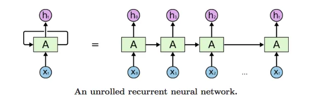
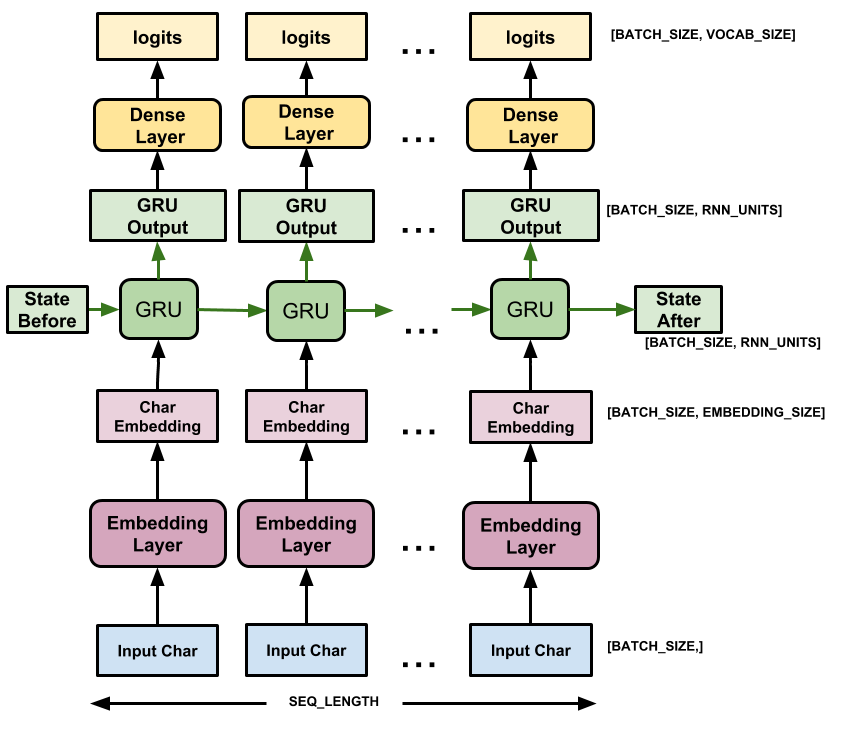

# Generating Text With Recurrent Neural Network

## Introduction

The goal of this project is to learn how to generate text using an RNN.

From this exercise, I learned:
1. How to create training examples and targets for text generation.
2. What RNN is and how to build an RNN model for sequence generation using Keras.
3. How to create a text generator and evaluate the output.

The tutorial I followed is available at the [TensorFlow's website](https://www.tensorflow.org/text/tutorials/text_generation)

## What is an RNN?



[[Image source]](https://aditi-mittal.medium.com/understanding-rnn-and-lstm-f7cdf6dfc14e)

A Recurrent Neural Network (RNN) is a type of artificial neural network designed for sequential data processing. Unlike traditional feedforward neural networks, which process input data in a single pass, RNNs have connections that form a directed cycle, allowing them to maintain a hidden state representing information from previous inputs. This hidden state enables RNNs to capture temporal dependencies in the data. RNNs excel in tasks where the order of input data matters (sequential data), such as time series prediction and natural language processing. RNNs can struggle to capture long-range dependencies due to vanishing or exploding gradients, tgus newer architectures like Long Short-Term Memory (LSTM) and Gated Recurrent Unit (GRU) are introduced. [This article](https://aditi-mittal.medium.com/understanding-rnn-and-lstm-f7cdf6dfc14e) also breaks down the key concepts of RNN very well. 

## How does an RNN learn how to predict the next word?

1. Tokenization:
   Turn the text into a form that the model can understand. For instance, "apple" = 1, "banana" = 2, and so on. For this exercise, I tokenized the characters because it was quick and easy. The smaller the token length, the fewer tokens we get. However, the text vector will get longer consequently, which can affect the learning behavior. 

2. Create the training data:
   We take a sequence of text from the data. For each input sequence, the corresponding targets contain the same length of text, except the target is shifted one character to the right. For example, if the input is "Tensorflo", then the target is "ensorflow". Although the entire phrase is predicted, only the last character is used. 

3. Create the model:
  
   The model consists of Embedding, RNN, and Dense layers.
   - Embedding: The input layer. A trainable lookup table that will map each character-ID to a vector with embedding_dim dimensions;
   - GRU: A type of RNN with size units=rnn_units
   - Dense: The output layer, with vocab_size outputs. It outputs one logit for each character in the vocabulary. These are the log-likelihood of each character according to the model.

  The feed-forward will occur until it fills up the sequence limit (it can run indefinitely). 

4. Train the model:
   Here I used "SparseCategoricalCrossentropy" for the loss and "Adam" for the optimizer. 

5. Generating text:
   Since the model returns a single character prediction at a time, we can generate the text by repeating the predictions based on the previous output. For instance, if I feed R and the prediction is O, then O is the input for the next iteration, eventually completing phrases like "ROMEO: ".

## Result

I used embedding_dim = 256 and rnn_units = 1024 (higher values yield more complex results but at a higher computational cost). This is the result after 30 epochs of training and then feeding 'JULIET' at the starter:

```
JULIET:
It is indeed, dishonour'd to entreat his life
And creeten times about his customery reverend
Master than Anneaming bore but stoopingly,
And not by time the king's dagger with
this, to entreat the queen's fires med
To speak and to wind me as unpless to you.

TRANIO:
Why, noble lords,
Will no other name with hate,
that same hence in the deed: delay away.
To wail the times have got me for it?

HENRY BOLINGBROKE:
Part, fool! it is a silk which now
'Save my petition's fors,
And part in tears till thither by our pinativaly are.
Say, you have expicef all my absent.
```
The sentences do not make sense. However, the characters do form sensible words mostly, and the structure of the text resembles the script of a play, which is the structure of the source text.

The result can be improved with:
1. Better word tokenization technique. For instance, tokenizing words instead of characters. 
2. More number of features in the layers, like the number of the embedding dimensions and the RNN units.
3. More training iterations.

